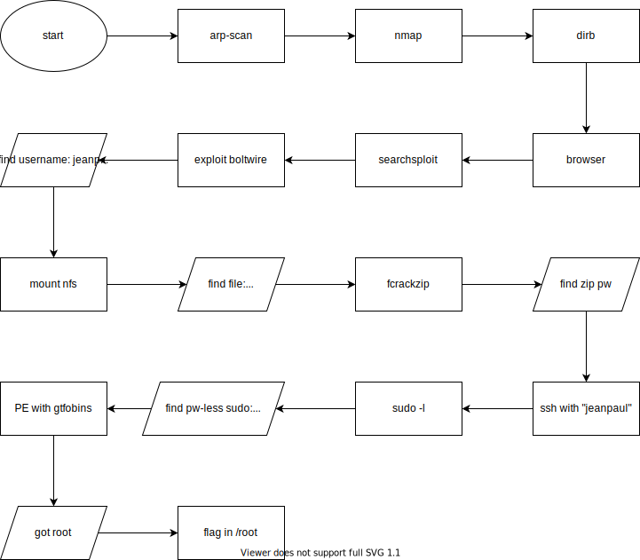

<!-- markdownlint-disable MD022 -->
<!-- markdownlint-disable MD025 -->

# Dev

- Part of the Capstone VMs
- An intensionally vulnerable VM

## Flow 

## Summary

- Debian 10
- Web server directory enumeration
- NFS mounting
- Zip pw cracking
- Privilege escalation via zip