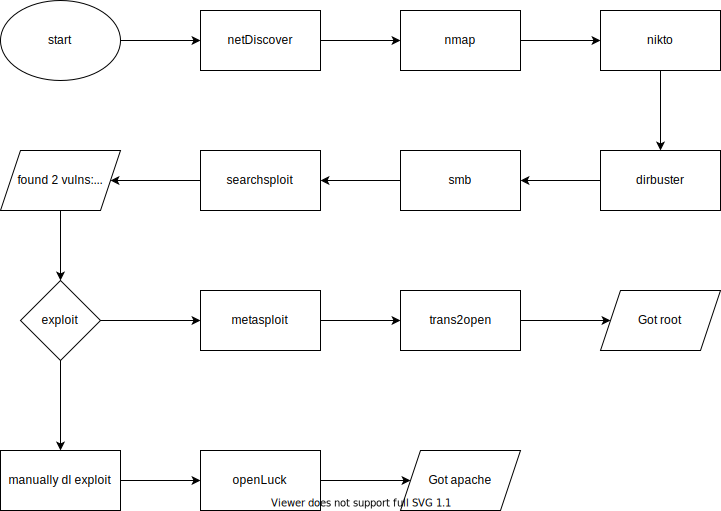

<!-- markdownlint-disable MD022 -->
<!-- markdownlint-disable MD025 -->

# Kioptrix

- Part of the Capstone VMs
- An intensionally vulnerable VM

## Flow

## Summary

- Red-Hat / Linux 2.4
- smb shares
- metasploit
- manual exploitation

---
