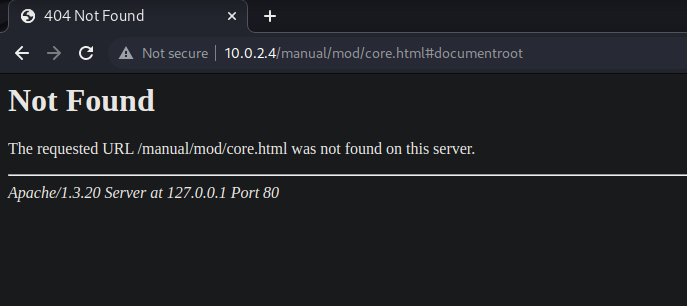

# Findings <!-- markdownlint-disable-line MD025 MD022 -->
{: .no_toc}

## Table of contents <!-- markdownlint-disable-line MD022 -->
{: .no_toc .text-delta}

- TOC
{:toc }

- 80/443 - 10.0.2.4
- Default webpage - Apache - PHP
- Information Disclosure

- Information Disclosure

- 80/tcp    open  http        Apache httpd 1.3.20 ((Unix)  (Red-Hat/Linux) mod_ssl/2.8.4 OpenSSL/0.9.6b)
- mod_ssl/2.8.4 - mod_ssl 2.8.7 and lower are vulnerable to a remote buffer overflow which may allow a remote shell. http://cve.mitre.org/cgi-bin/cvename.cgi?name=CVE-2002-0082, OSVDB-756.
- Webalizer Version 2.01
- SMB: Unix (Samba 2.2.1a)
- SSH: OpenSSH 2.9p2

---
