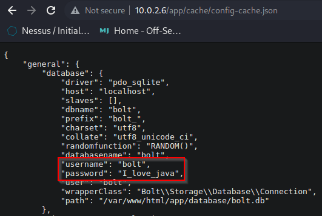
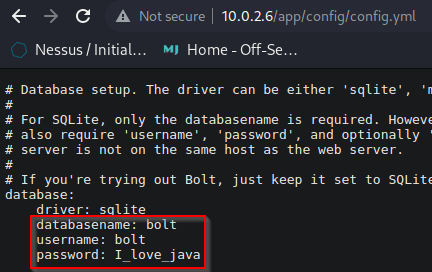
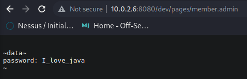
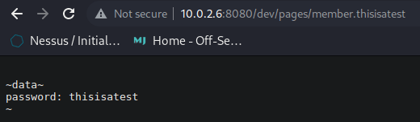

# Findings <!-- markdownlint-disable-line MD025 MD022 -->
{: .no_toc}

## Table of contents <!-- markdownlint-disable-line MD022 -->
{: .no_toc .text-delta}

- TOC
{:toc }

## Open Ports

- 22/tcp    open  ssh      OpenSSH 7.9p1 Debian 10+deb10u2 (protocol 2.0)
- 80/tcp    open  http     Apache httpd 2.4.38 ((Debian))
- 8080/tcp  open  http     Apache httpd 2.4.38 ((Debian))
  - PHP 7.3.27-1~deb10u1 - phpinfo()
- 2049/tcp  open  nfs_acl   3 (RPC #100227)

## Credentials

### Port 80

### Port 8080

## Information Disclosure

---
