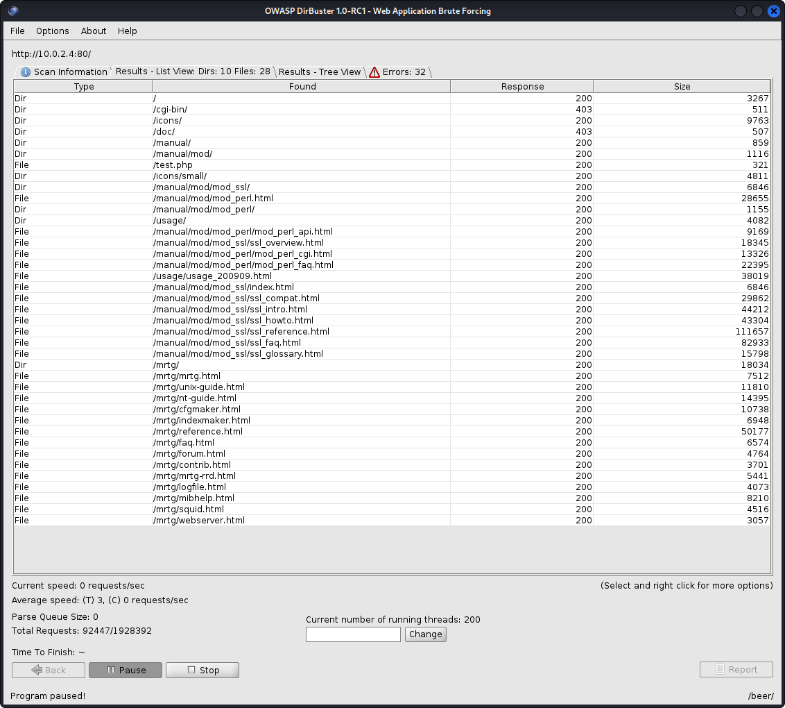
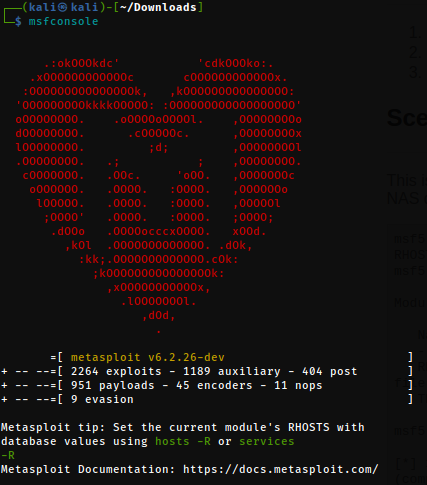
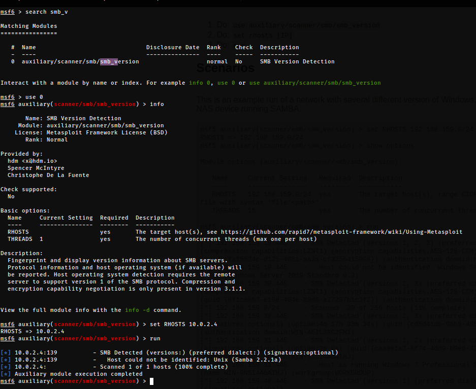
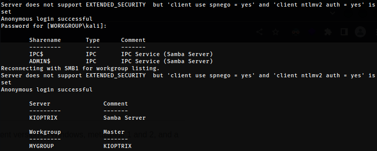
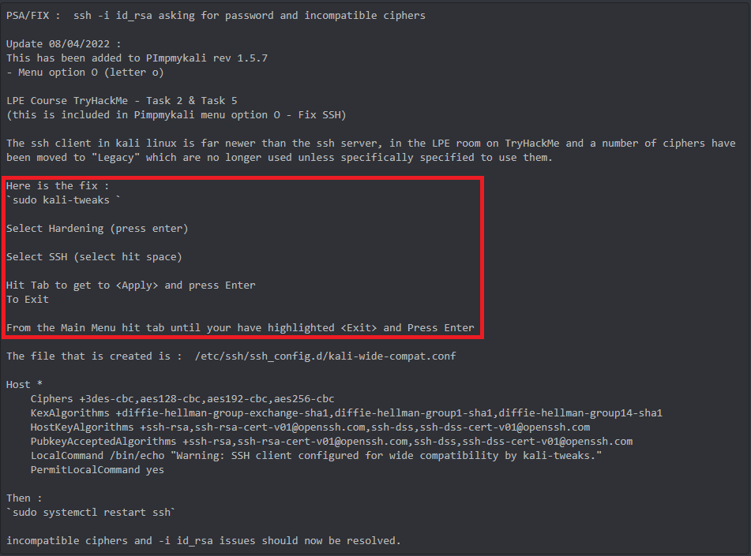

# Flow
{: .no_toc}

## Table of contents
{: .no_toc .text-delta}

- TOC
{:toc }

## Scanning & Enummeration

### NetDiscover
```console 
sudo netdiscover -r 10.0.2.0/24
```
[NetDiscover results](../../assets/TCM-Sec/Kioptrix/NetDiscover.txt)
### NMap
``` console
sudo nmap -T4 -p- -A 10.0.2.4
```
[nmap tcp scan](../../assets/TCM-Sec/Kioptrix/nmap%20tcp.txt)  

```console
sudo nmap -T4 -sU 10.0.2.4 
```
[nmap upd scan](../../assets/TCM-Sec/Kioptrix/nmap%20udp.txt)

### Nikto
```console
nikto -h http://10.0.2.4
```
[nikto results](../../assets/TCM-Sec/Kioptrix/nikto.txt)

### DirBuster 
- Use GET requests only
- Go Faster
- wordlist: "/usr/share/wordlists/dirbuster/directory-list-2.3-small.txt"
  


### Metaspliot

- search for "smb/smb_version"

``` console
msfconsole          // start metasploit
search smb_V        // search for a module to find smb versions
use 0               // use the found module
info                // get infos on how to use the module
set RHOST 10.0.2.4  // set the host (target)
run                 // run the module
```




### smbclient

List smb services

```console
smbclient -L \\\\10.0.2.4\\
```

### Flags
{: .no_toc}

```console
-L : List services
```

### Findings
{: .no_toc}



> 2 hares found!

```console
smbclient -L \\\\10.0.2.4\\ADMIN$
```


```console
smbclient -L \\\\10.0.2.4\\IPC$
```

> Sucess!!!

```console
ls
```


> Network access denied... damn

### ssh

```console
ssh 10.0.2.4
```

```console
Unable to negotiate with 10.0.2.4 port 22: no matching key exchange method found. Their offer: diffie-hellman-group-exchange-sha1,diffie-hellman-group1-sha1
```

```console
ssh 10.0.2.4 -oKexAlgorithms=+diffie-hellman-group1-sha1
```

```console
Unable to negotiate with 10.0.2.4 port 22: no matching host key type found. Their offer: ssh-rsa,ssh-dss

```



> After fix

```console
The authenticity of host '10.0.2.4 (10.0.2.4)' can't be established.
RSA key fingerprint is SHA256:VDo/h/SG4A6H+WPH3LsQqw1jwjyseGYq9nLeRWPCY/A.
This key is not known by any other names
Are you sure you want to continue connecting (yes/no/[fingerprint])? yes
Warning: Permanently added '10.0.2.4' (RSA) to the list of known hosts.
kali@10.0.2.4's password: 

```
> No banner with further infos sadly

## Research

### google

- `Samba 2.2.1a exploit`
- `mod_ssl/2.8.4 exploit`

### searchspliot

```console
searchsploit Samba 2.2.1a 
```

```console
searchsploit mod_ssl 2.8.4
```

---
